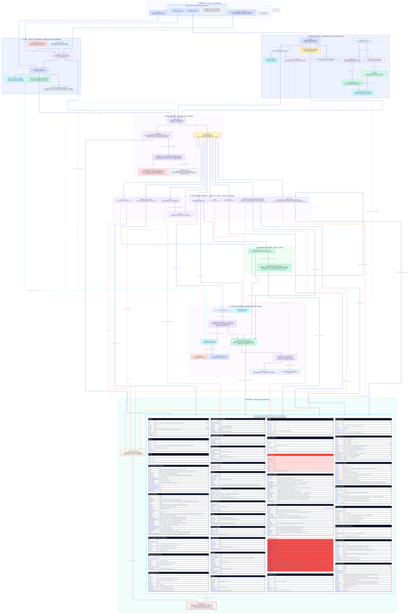
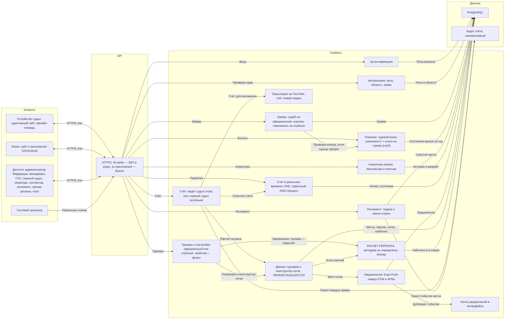
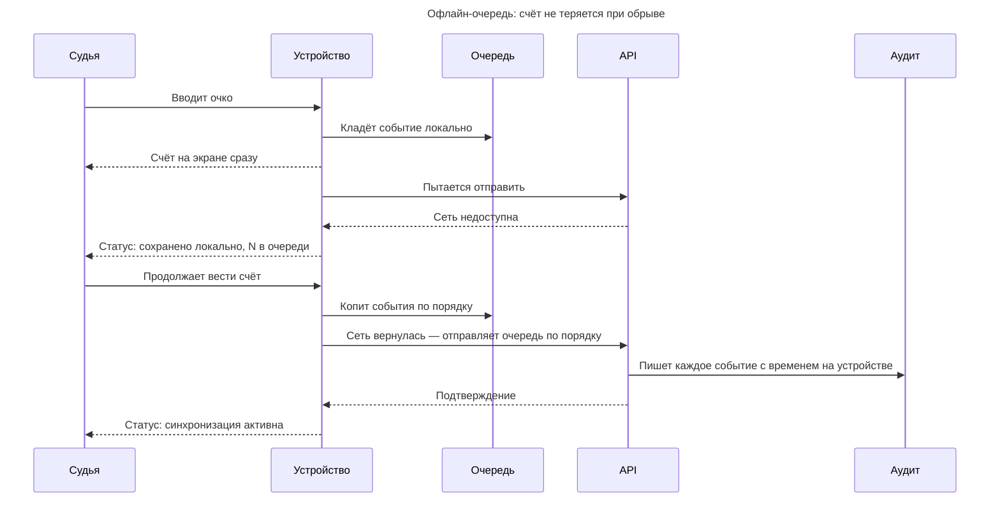
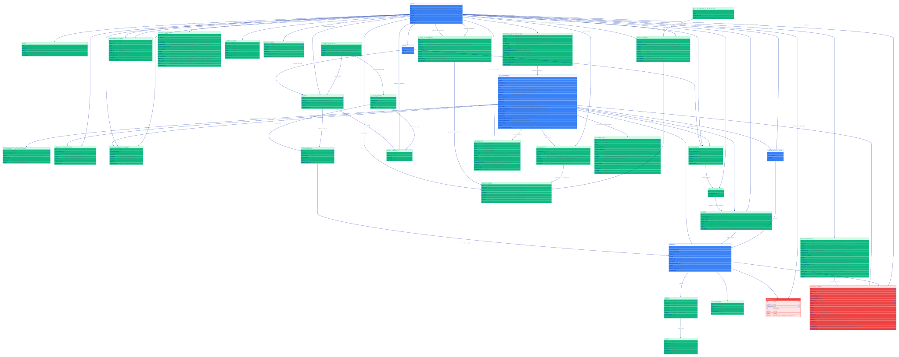

# Системный дизайн

Из чего состоит система.

- Пользовательские сценарии — [USERFLOW.md](USERFLOW.md)
- Требования — [TZ.md](TZ.md) · Дизайн — [DESIGN.md](DESIGN.md)

---

## 1. Клиенты и их форм-факторы

Форм-фактор здесь — не деталь, а требование. Он вытекает из того, **где физически
находится человек**, и определяет, что вообще можно нарисовать на экране.

| Роль (§2) | Устройство | Почему так |
|---|---|---|
| 1 · Администратор Федерации | **десктоп** | полный доступ ко всем модулям, правка данных, пользователи и процессы |
| 2 · Экономист / бухгалтер | **десктоп** | проверяет и подтверждает оплаты, ведёт взносы |
| 3 · Менеджер по спортивной работе | **десктоп** | видит все модули, ничего не правит |
| 4 · Менеджер по организации соревнований | **десктоп** | видит все модули, ничего не правит |
| 5 · Председатель ГСК | **десктоп** | судейские коллегии, назначение судей, утверждение результатов |
| 6 · Главный судья соревнований | **десктоп** | ведёт турнир: сетки, результаты, дисциплинарные решения |
| 7 · Главный секретарь соревнований | **десктоп** | жеребьёвка, сетки, расписание, протоколы |
| 8 · Заместитель главного судьи | **десктоп** | функционал в документе федерации не указан |
| 9 · Судья | **адаптивный сайт, обычно планшет** | ведёт матч за столом; нужен крупный счёт и кнопки регламента; работает и с телефона |
| 10 · Инспектор / супервайзер | **десктоп** | контроль качества судейства, проверки, заключения |
| 11 · Главный тренер национальной команды | **десктоп** | функционал в документе федерации не указан |
| 12 · Старший тренер региона | **десктоп** | формирует состав региона и подаёт заявку на чемпионаты РК |
| 13 · Администратор клуба | **десктоп** | регистрирует клуб, спортсменов и тренеров; заявки на клубные соревнования; клубные турниры и плата за турнир |
| 14 · Спортсмен | **сайт и приложение iOS/Android** | в зале между матчами и дома; смотрит свой матч и аналитику; на открытые и клубные записывается сам |
| — посетитель без входа | любое, веб | только чтение; роли у него нет |

Приложение есть только у игрока. Все остальные роли работают с адаптивного
сайта, а push в браузер решено не делать (QUESTIONS 11.1). Отсюда открытое
следствие: вызов на стол судье нужен мгновенно, а канала push у него нет.

---

## 2. Архитектура

### Принятые решения

**Счёт и регламент — разные сервисы.** Ввод очка и смена сторон выглядят как
«кнопки на одном экране», но это разные вещи: первое меняет результат матча и
рейтинг, второе — процедурное событие. Смешивать их в одном сервисе значит
смешивать и правила отката.

**Движок — отдельный узел, хотя физически это библиотека.** Показан отдельно
потому, что он **переиспользуется** из существующей системы, и его границу важно
видеть: всё, что внутри, не переписывается. Даёт стандартные форматы **и
конструктор нестандартных сеток** (см. [TZ.md](TZ.md) §5).

**Рейтинг — методика не определена, и это блокер.** Раньше здесь стояло «ELO с
фиксированными коэффициентами». Это было наше предположение, а не решение
федерации: [TZ.md](TZ.md) §7.1 ссылается на Приложение А, которого не
существует (QUESTIONS 5.1). Сервис в архитектуре остаётся — считать всё равно
придётся, — но его содержимое пока пустое, и планировать сроки по нему нельзя.
Что известно точно: пересчёт запускается после закрытия итогового протокола
([TZ.md](TZ.md) §4.8), не задваивается при повторе, и в него идёт **любой
рейтинговый турнир** — официальные всегда, клубные по флагу `is_rated`
([TZ.md](TZ.md) §4.1).

**Фронт — Feature-Sliced Design + PostCSS/CSS.** Код веба разложен по слоям FSD
(`src/shared → entities → features → widgets → views`, `app/` — только Next-роутинг,
импорт «вниз»). Стили — **PostCSS + нативный CSS** (CSS Modules, кастомные свойства,
`@layer`); Tailwind, оказавшийся в старом коде `front/`, **убран** (фронт пересобран начисто) под это
решение. Подробности — в разделе «Фронт».

**Мультиязычность — i18next на веб и мобилке.** UI-строки (RU/KK/EN) — один движок
`i18next`/`react-i18next` с общими JSON-ресурсами на обе платформы; контент CMS —
`wagtail-localize`; пользовательские данные хранятся как введены (QUESTIONS 14.1).
Самописный `t`-объект (был на вебе) заменяется: он client-only и не шарится с
приложением. Подробнее — раздел «Мультиязычность».

**Веб-пуш убран — доставка через Expo Push.** В коде бэка был браузерный Web Push
(VAPID/pywebpush); он удалён в пользу единственного канала — **Expo Push** в
приложение игрока (QUESTIONS 11.1). In-app лента уведомлений (`Notification`)
сохранена. Django — версия **5** (в ТЗ стояла устаревшая 4.2).

**Тестирование — TDD для движка и рейтинга, пайплайн юнит → интеграция → e2e.**
Чистая логика с высокой ценой ошибки пишется **тест-первой**: движок сеток
(`bracket.py`), **раскладка сетки** (`layoutSingleElimination`), рейтинг судей
S1–S4, расчёт расписания, инварианты (стол не занят дважды, без задвоений).
Экраны и вёрстка — не по строгому TDD. Слои и инструменты:

- **юнит + интеграция на каждом слое:** бэк — `pytest`/`pytest-django`
  (+`factory_boy`, DRF `APIClient`); веб — **`Vitest` + React Testing Library**
  (+ `jest-dom`, `user-event`); мобилка — **`Jest`/`jest-expo` +
  `@testing-library/react-native`**;
- **e2e на критичных сквозных сценариях:** веб — **`Playwright`** (браузер),
  мобилка — **`Maestro`** (YAML-флоу на эмуляторе); нагрузка — **`k6`**.

**Правило:** ни одна фича не считается готовой без e2e-прогона на своей платформе
(веб — Playwright, RN — эмулятор/Maestro). Skia-контент в приложении не попадает
в accessibility-дерево — Maestro проверяет RN-обвязку и жесты, канвас фиксируем
скриншотом. Подробно — [TESTING.md](TESTING.md); рабочее правило — корневой
`CLAUDE.md`.

**Отображение сеток — React Flow.** Турнирную сетку (дерево) показываем через
**React Flow** (`@xyflow/react`): узлы-матчи в нашем дизайне (стекло, Lucide),
рёбра-коннекторы, зум/панорама (сетка на 32–64 участника широкая, особенно на
телефоне), обновление по SSE после каждого результата. Группы/круговая — это **не
дерево, а таблица**, отдельным компонентом. FSD-виджет `widgets/bracket`. Важно:
**«конструктор» (ТЗ §5.2) — это гибкость генерации** (любое число участников,
нестандартные схемы), **не** drag-редактор. Лицензия React Flow — **MIT**
(коммерческое использование бесплатно); бейдж скрываем через CSS — по MIT это
допустимо, но xyflow просит подписку Pro для коммерческого скрытия (пожелание, не
пункт лицензии — решение федерации). React Flow — **веб-only** (React DOM), в
приложении (React Native) не работает — сетку в мобилке рендерим на
**`react-native-skia`** (нативный canvas на GPU). Он держит большое зумируемое
дерево (32–64+) на 60fps там, где `react-native-svg` с его деревом узлов проседает
по кадрам при пинч-зуме; цена — +3–5 МБ к бинарю и нужен dev-build (он у нас и так
есть из-за пуша). Жесты — `react-native-gesture-handler` + `reanimated`.
Группы/круговая — таблицей (обычные `View`, не дерево). **WebView с React Flow не
берём** (мост медленный, неродно для живого экрана — «Native Shell, Web Leaf»).
Общая между вебом и мобилкой — только **модель данных сетки** (из движка).

**Роли: четырнадцать** — по перечню федерации, см. [TZ.md](TZ.md) §2.
**Администратор Федерации** держит платформу целиком: правит данные, ведёт
пользователей и процессы. Это безопасно потому, что система именная и каждое
действие записано с автором. Судейство разнесено на пять ролей: **председатель
ГСК** назначает судей и утверждает результаты, **главный судья соревнований**
ведёт один турнир, **главный секретарь** делает жеребьёвку, сетки, расписание и
протоколы, **заместитель** подменяет главного, **судья** ведёт матч за столом.
**Инспектор / супервайзер** турниром не управляет — проверяет качество судейства
и пишет заключение.

**Отдельный класс прав — чтение без записи.** Роли 3 и 4 (менеджер по спортивной
работе, менеджер по организации соревнований) видят все модули и не правят
ничего. Это не «роль пониже», а другое измерение: в авторизации право на чтение
и право на запись должны проверяться раздельно, иначе такую роль приходится
собирать вычитанием, и любой новый модуль по умолчанию окажется ей доступен на
запись.

**Тип управления, а не категория.** Определяющее различие — кто турнир заводит:
**официальный** (Федерация / ГСК) или **клубный** (администратор клуба). «Лига»
и «любительский» — это клубные турниры, а их свойства (судьи, рейтинг, плата за
турнир, ценз по рейтингу) — независимые поля-политики, а не следствие ярлыка.
В модели это набор собственных полей турнира (`approval_by`, `rating_pool`,
`fee_model`, …), засеянных шаблоном регламента, а не enum с зашитым поведением:
иначе любое исключение потребует новой категории.

**Счёт вводит судья стола или главный судья.** Там, где судей на столах нет
(клубные турниры), счёт ведёт главный судья: победитель называет ему результат,
судья вводит ([TZ.md](TZ.md) §6.4). Ввода игроком и подтверждения соперником
нет. Для сервиса счёта это два разных источника (`судья стола | главный судья`) с
одинаковым правилом фиксации. Прямой эфир и трансляция на YouTube в клубном
сценарии не работают — некому вести счёт по очкам.

**Взносы — отдельный сервис.** Годовой взнос ведёт экономист, а заявка игрока
проверяет его состояние, но только если турнир этого требует ([TZ.md](TZ.md)
§9.2). Отделён от заявок потому, что это деньги и учёт со своим жизненным циклом
(год, просрочка), и потому, что связь между взносом и допуском сама по себе
открытый вопрос (QUESTIONS 6.1).

**Счёт в реальном времени — отдельный компонент, транспорт не выбран.**
Обновление счёта у зрителей — архитектурное решение (частый опрос против
постоянного соединения), и его надо принять осознанно, а не унаследовать.
Работает на многих столах одновременно.

**Трансляция на YouTube — отдельный сервис.** Счёт накладывается на видео со
столов автоматически из ввода судьи (см. [TZ.md](TZ.md) §6.3), без оператора,
и встраивается на страницу турнира. Отделён от счёта, потому что это внешняя
интеграция со своим темпом и режимом сбоев.

**У игрока два канала, и это «и», а не «или».** Веб и нативное приложение под
Android и iOS — не альтернатива друг другу и не «основной и запасной». Дома и с
чужого компьютера игрок заходит на сайт, в зале между матчами — с приложения, и
это один и тот же человек в один и тот же день. Поэтому:

- оба канала **полноценные**: приложение не урезанная версия сайта, а сайт не
  заглушка «скачайте приложение». Функциональность игрока одинаковая в обоих;
- **один аккаунт, одни данные, один backend** — общие сервисы и общая база, без
  отдельного мобильного API со своей логикой;
- единственное настоящее различие — **push**: в приложении он штатный, а в вебе
  его решено не делать (QUESTIONS 11.1);
- на схеме это два отдельных узла внутри рамки «Игрок», а не одна строка «сайт и
  приложение»: одна строка читалась как «где-то одно из двух».

Расширенная аналитика платная — единственная точка монетизации ([TZ.md](TZ.md)
§11), и она тоже должна быть в обоих каналах.

**Аутентификация и авторизация разведены.** RBAC с десятью ролями — ядро этого
ТЗ, а не деталь входа по паролю. Роль это не глобальный флаг, а связка
пользователя, роли и области: один человек бывает тренером в клубе А, судьёй
стола на турнире Б и игроком на турнире В ([TZ.md](TZ.md) §2).

**Push-уведомления — отдельный сервис, канал не выбран.** Семь событий процесса
и их получатели перечислены в [TZ.md](TZ.md) §10.1. Push доставляется только в
приложение игрока: в браузере его решено не делать (QUESTIONS 11.1). Нерешённым
остаётся следствие — вызов на стол судье нужен мгновенно, приложения у него нет,
и это самое узкое место.

---

## 3. Технологический стек

**Откуда взят.** Это стек, на котором команда уже работает: бэкенд `tt_back`
(Django + DRF, PostgreSQL, S3) и фронтенд `tt_front` (Next.js). Для платформы
ФНТ он **не подтверждён отдельным решением** — здесь он зафиксирован как
отправная точка, потому что переиспользовать знакомое дешевле, чем выбирать
заново. Если для этого проекта решено иначе, менять надо здесь.

| Слой | Чем делаем | Откуда известно |
|---|---|---|
| Бэкенд | Python 3.11, Django 5, Django REST Framework | `back/`: requirements.txt |
| Запуск | gunicorn в Docker, миграции на деплое | `tt_back`: Procfile, Dockerfile |
| База | **PostgreSQL**, доступ через psycopg2, адрес из `DATABASE_URL` | `tt_back`: psycopg2-binary, dj-database-url |
| Файлы | **Cloudflare R2** — документы к заявкам, фото. S3-совместимый API, поэтому boto3 работает без правок | `tt_back`: boto3, `AWS_STORAGE_BUCKET_NAME`, `AWS_S3_ENDPOINT_URL` |
| Статика | whitenoise | `tt_back`: requirements.txt |
| Веб | Next.js 16, React 19, TypeScript; стили — **PostCSS + нативный CSS** (CSS Modules, кастомные свойства, `@layer`); структура — **Feature-Sliced Design** (`src/{shared,entities,features,widgets,views}`, `app/` — только роутинг) | `front/`: package.json |
| Приложение игрока | Expo (React Native), TypeScript; стили — Unistyles 3 (нативный движок: тема, варианты, без ре-рендера); Android и iOS, те же сервисы и данные (§1) | `tt_tournament/mobile`; [TZ.md](TZ.md) §10 |
| Push | **Expo Push Service** поверх FCM и APNs; на устройстве `expo-notifications` | решение этого документа, см. «Уведомления» |
| CMS · контент | **Wagtail** (в том же Django) — новости, анонсы, статические страницы; медиа в R2 | `tt_back`; см. «Новости и анонсы» |

**Строки и байты лежат в разных местах, и это видно на схеме.** PostgreSQL и
R2 — два разных хранилища у двух разных поставщиков, поэтому в системном дизайне
это два соседних блока, а не один слой «данные». В базу идут строки, в R2 —
файлы; в PostgreSQL от файла остаётся только ключ объекта. Иначе дамп базы
распухает на фотографиях и перестаёт быстро восстанавливаться.

Разделение вскрыло пробел: файлами никто не владел. У `USER` есть `photo_url`, у
заявок — документы, но фото не относится ни к аутентификации, ни к заявкам.
Поэтому в прикладных сервисах появился **профиль и аккаунт** — он пишет строки в
базу и фото в R2.

**Почему PostgreSQL, а не что-то ещё.** Доменная модель (§5) реляционная по
сути: заявки, составы, матчи, партии и розыгрыши связаны внешними ключами, а
итоговый протокол и рейтинг считаются выборками по ним. Плюс два требования, где
реляционная база отвечает прямо: журнал правок счёта не редактируется и не
удаляется (§12 ТЗ), а рейтинг пересчитывается транзакционно после утверждения
протокола — половинчатый пересчёт недопустим.

### Фронт: где что выполняется

**Веб — Next.js 16, App Router.** У него две половины, и от того, в какой
выполняется код, зависит, что вообще возможно.

| Где | Что там | Почему |
|---|---|---|
| Серверные компоненты (RSC) | страница турнира, сетка, состав, профиль, публичные страницы | данные тянутся на сервере Next, в браузер приезжает готовая разметка |
| Клиентские компоненты | интерактив, формы, локальное состояние | после гидрации |
| Мутации | прямо в Django, мимо сервера Next | см. ниже — Server Actions не используем |

**Кэша пока нет совсем, и это решение, а не недоделка.** Ни ISR, ни кэша
запросов: каждый рендер идёт в Django за свежими данными. Турнир — штука живая,
сетка и состав меняются прямо во время игры, и устаревшая страница здесь дороже
лишнего запроса. Кэш вернём, когда станет видно, какие страницы читают заметно
чаще, чем меняют, — тогда это будет измеримое решение, а не догадка.

**Только из браузера — и это не выбор, а свойство технологии.** SSE
(`EventSource`), подписка на push и оптимистичный отклик не могут жить в
серверном компоненте: он отрендерился и умер, держать открытое соединение или
хранить ключ устройства ему нечем.

**Server Actions не используем.** Раньше здесь стоял выбор между ними и прямым
запросом в API, и склонялись к Actions. Разбор показал, что довод был слабый.

Единственное, ради чего Server Actions действительно нужны в нашей схеме, — это
сбросить кэш Next после мутации: `revalidatePath` и `revalidateTag` работают
только на сервере, и без них страница продолжала бы отдавать вчерашнюю сетку.
Кэш убрали — сбрасывать нечего, и лишний прыжок браузер → Next → Django остаётся
без причины.

Довод «браузер не видит адресов Django» не считается вовсе: приложение на Expo
ходит в Django напрямую, значит API и так смотрит наружу. Прятать от браузера
то, что открыто телефону, смысла нет.

Побочная выгода: у веба и приложения теперь **один и тот же путь мутаций**, то
есть один контракт, который проверяют оба клиента, вместо двух расходящихся.

Цена — куки. Запрос из браузера в Django становится кросс-доменным, поэтому сайт
и API должны жить под общим родительским доменом (`fnt.kz` и `api.fnt.kz`), а
CORS настраивается с `credentials`. Токен при этом остаётся в httpOnly-куке и в
JavaScript не попадает. Серверу Next при рендере куку по-прежнему пробрасываем
вручную — автоматически она в его исходящий запрос не уходит.

**Стили — PostCSS и нативный CSS, а не отдельный язык.** Пишем обычный CSS и
опираемся на возможности самого браузера; PostCSS в сборке только префиксует
(`autoprefixer`) и полифилит новые фичи под старые браузеры (`postcss-preset-env`)
— своих возможностей у него нет, всё делают плагины. Масштаб при этом даёт не
препроцессор, а три вещи: **CSS Modules** — локальный скоуп (нет глобальных
коллизий классов, безопасный рефактор и переименование), **кастомные свойства**
(`--token`) — токены дизайна и темизация в рантайме (тёмная тема без пересборки,
чего компайл-тайм-переменные Sass не умеют), **`@layer`** — явный порядок
каскада, снимающий войны специфичности на больших наборах стилей. Sass не берём:
его переменные заморожены на сборке, а программная генерация правил нам не нужна.
Runtime CSS-in-JS (styled-components, Emotion) не берём тем более — рантайм-стоимость
на каждый рендер и трение с серверными компонентами App Router. **Tailwind, попавший
в старый код `front/`, убран** (фронт пересобран начисто под это решение).

**Структура фронта — Feature-Sliced Design.** Код разложен по слоям
`src/shared → entities → features → widgets → views`, импорт только «вниз»;
Next-роутинг (`app/`) остаётся тонким и лишь зовёт вью. Так фичи изолированы, а
рефактор одной не задевает соседние.

**Приложение — Expo (React Native).** Главное отличие: **серверной половины
здесь нет вообще**. Ни RSC, ни Server Actions, ни ISR — все экраны рендерятся на
устройстве, данные тянутся прямо из API. Вопрос «что на сервере, а что на
клиенте» тут не стоит: всё на клиенте.

Два места, где приложение расходится с вебом, и оба упираются в бэкенд:

- **Авторизация.** httpOnly-куки в приложении не работают. Токен лежит в
  `SecureStore` и уходит заголовком `Authorization`. Токен тот же, транспорт
  другой — API должен принимать оба.
- **SSE.** В React Native нет `EventSource`, нужен polyfill
  (`react-native-sse`). Сам поток тот же, что у веба.

**Стили — симметрично вебу: нативные примитивы плюс типизированные токены, без
утилитарного фреймворка и без runtime CSS-in-JS.** В React Native нет CSS —
стили это объекты `StyleSheet`. Поверх берём **Unistyles 3**: движок на C++/JSI,
он обновляет стили **без ре-рендера**, а API остаётся в стиле `StyleSheet` (тема,
варианты, брейкпоинты). То есть стили лежат отдельно от разметки — тот же принцип,
что CSS Modules на вебе. **NativeWind** не берём: это тот же утилитарный подход,
что и отклонённый на вебе Tailwind; **styled-components/Emotion** — тот же runtime
CSS-in-JS, отклонённый там же. Токены дизайна — один типизированный TS-модуль,
общий язык с вебом на уровне значений. Оговорка Unistyles «не работает в Expo Go»
нам ничего не стоит: **remote-push и так не работает в Expo Go начиная с SDK 53**,
поэтому приложение всё равно собирается через **dev-build / EAS**, а не запускается
в Expo Go — ограничение снимается тем же решением, что нужно для пуша.

**Путь релиза приложения.** Начало общее — **EAS Build**, облако Expo собирает
бинарники обеих ОС, свой мак для iOS не нужен. Дальше пути расходятся: у Apple
и Google свои тестовые треки, свои ревью и главное — свои скорости. Когда надо
срочно чинить, «часы у Google» и «день-два у Apple» — это два разных плана
действий, поэтому на схеме они нарисованы отдельными ветками.

Ветка Apple:

- **TestFlight.** Внутренние тестеры видят сборку сразу; внешние (судьи,
  федерация) — после лёгкой проверки Apple, обычно в тот же день. Это ответ на
  «как показать заказчику до релиза»: ссылка-приглашение, не файл по почте.
- **App Store.** Ревью обычно день-два, бывает дольше. **Откатить
  опубликованный бинарник нельзя** — при проблеме только новая версия через
  новое ревью.

Ветка Google:

- **Внутренний трек Play Console.** Тестеры по ссылке, проверки Google нет,
  обновления уходят за минуты.
- **Google Play.** Ревью — часы. Поэтапная раскатка по проценту пользователей:
  проблема видна на 5% аудитории раньше, чем у всех.

Сходятся ветки на **`expo-updates`** — правки по воздуху общие для обеих ОС.
JavaScript и ассеты уезжают мимо ревью за минуты; этим закрывается срочный
фикс, который иначе ждал бы Apple сутки. Граница жёсткая: новая нативная
библиотека по воздуху не уедет, это снова полный круг через магазин.

Из шага 3 следует и правило совместимости API (см. «Что остаётся нерешённым»):
старые сборки живут у людей неделями, ломать вчерашний контракт нельзя.

### Счёт в реальном времени: SSE

**Server-Sent Events**, а не WebSocket. Счёт идёт в одну сторону — сервер
рассказывает клиентам, что изменилось. Обратный канал не нужен: судья
отправляет очко обычным `POST`, и смешивать это с потоком незачем. SSE проще:
это обычный HTTP-ответ, который не закрывается, он проходит через прокси без
отдельной настройки апгрейда соединения, а браузер сам переподключается при
обрыве — в зале с нестабильной сетью это не мелочь.

**Чего это стоит.** Соединение висит открытым, а синхронный воркер gunicorn
занят им целиком: сто зрителей одного турнира съедят сто воркеров, и API
встанет. Поэтому поток обслуживает **отдельный ASGI-процесс** (uvicorn), а
синхронный gunicorn остаётся под обычные запросы. Это не деталь развёртывания,
а следствие выбора: без разделения процессов SSE на Django ломает то, к чему
подключён.

Когда SSE окажется мало — если понадобится обратный канал с низкой задержкой,
например одновременное редактирование сетки, — переходим на WebSocket через
Django Channels. Сейчас такой задачи нет.

**Как событие попадает из API в поток.** Разделение процессов создаёт вопрос,
который долго висел на схеме нерешённым: счёт принимает gunicorn, поток держит
uvicorn, а общей памяти у двух процессов нет. Транспорт — **`LISTEN/NOTIFY` в
самом PostgreSQL**: сервис счёта записывает очко и делает `NOTIFY` с id матча,
SSE-процесс слушает канал, дочитывает счёт из базы и отдаёт в поток. Отдельный
брокер (Redis) не заводим — правило то же, что и всюду в этом документе: не
добавлять хранилище, пока единственное, что от него нужно, умеет Postgres. Одно
ограничение знаем заранее: `NOTIFY` передаёт не больше 8 КБ, поэтому в сообщении
только идентификатор, данные получатель читает из базы сам.

### Фоновая работа: третий процесс

Всё остальное в системе отвечает на запросы. Но три вещи должны случаться
**без входящего запроса**, и до ревизии дизайна исполнителя для них не было:

- **рассылка уведомлений** — событие «матч готов» уходит десяткам получателей,
  и держать HTTP-запрос судьи открытым, пока уходят все, нельзя;
- **квитанции Expo Push** — статус доставки забирается отдельным запросом через
  минуты после отправки; некому «вспомнить» об этом, если все процессы только
  ждут входящих;
- **пересчёт рейтинга** — после утверждения итогов это долгая транзакция по
  всем участникам.

Поэтому на Railway живёт **третий процесс — воркер**. Он не принимает запросов
вообще: берёт задачи из очереди и выполняет. Очередь — **procrastinate**,
библиотека, у которой хранилище задач лежит в том же PostgreSQL, а будится
воркер тем же `LISTEN/NOTIFY`. Celery не берём осознанно: он требует Redis или
RabbitMQ, то есть второе хранилище со своим режимом сбоев, ради возможностей,
которые нам пока не нужны. Если очередь перерастёт Postgres — мигрируем, но это
решение будущего с фактами на руках.

### Уведомления

Семь событий и их получатели перечислены в [TZ.md](TZ.md) §10.1. Как они
доставляются:

**Отправщик — Expo Push Service.** Это не альтернатива FCM и APNs, а релей
поверх них: Django шлёт один POST на `exp.host`, Expo разводит по платформам.

Сначала здесь был прямой FCM, и держался он на одном доводе: FCM закрывает и
браузер тоже, а вопрос 11.1 был открыт. Вопрос закрыт — веб-push не нужен, а
если понадобится, его делают отдельным каналом. Довод исчез вместе с
неопределённостью, и остался простой счёт: мы уже на Expo, отправка — один HTTP
без `firebase-admin` в зависимостях и без ключа APNs в переменных Django,
ключами управляет EAS. На устройстве `getExpoPushTokenAsync`, один тип токена на
обе ОС.

**Что мы за это отдали.** В цепочке доставки появился третий участник, бесплатный
и без SLA. Для «вас вызвали на стол» — уведомления с крайним сроком — это
единственное место, где решение может отозваться. Риск принят сознательно:
переезд на прямой FCM стоит примерно день (меняется тип токена и путь отправки на
сервере, `expo-notifications` на устройстве остаётся), так что решение обратимо.

OneSignal не рассматривали всерьёз: его ценность — сегменты и рассылки, а у нас
семь транзакционных событий, под них это лишний вендор и лишний SDK.

**Квитанции обязательны.** Expo принимает отправку и отвечает билетом, а
доставку подтверждает отдельным запросом за квитанцией. Без этого шага нельзя
узнать, что токен умер после переустановки приложения: `DeviceNotRegistered` в
квитанции — сигнал удалить токен, иначе список устройств копит мусор и часть
уведомлений уходит в никуда.

| Куда | Чем | Состояние |
|---|---|---|
| Приложение игрока (Android) | Expo Push → FCM | решено |
| Приложение игрока (iOS) | Expo Push → APNs | решено |
| Браузер: судьи, тренеры, ГСК, экономист | — | **решено не делать** (QUESTIONS 11.1); если понадобится — отдельный канал |
| Внутри интерфейса | лента уведомлений в самом приложении | решено, работает всегда |

**Лента в интерфейсе — не дубль, а основа.** Push можно не увидеть, отключить в
настройках телефона, потерять при смене устройства. Поэтому каждое событие
ложится в ленту внутри системы, а push — только способ привлечь внимание
быстрее. Тогда пропущенный push не означает потерянное действие.

### Новости и анонсы

Портал новостей и анонсов федерации — это **контент, а не живые данные**, и это
меняет почти все решения по сравнению с турнирной частью.

**Готовый CMS — Wagtail, и это не второй бэкенд.** Нужен нормальный редактор, а
не голая админка, но заводить Strapi/Sanity/Ghost — это отдельный сервис, база и
контур авторизации против нашего «один аккаунт, одни данные, один backend».
Wagtail снимает выбор: это зрелый CMS, **написанный на Django**, поэтому он живёт
в том же проекте и той же PostgreSQL, с теми же пользователями и правами, тем же
деплоем. Из коробки — rich-text редактор (StreamField), **медиа-библиотека** (в
R2 через `django-storages`), черновики, превью, отложенная публикация, ревизии,
воркфлоу согласования и **мультиязычность** (`wagtail-localize`, рус/каз). Он же
держит статические страницы: «О федерации», регламент, документы, контакты.

Пост — тип страницы Wagtail (`NEWS_POST`, §5): заголовок, тело StreamField,
обложка из медиа-библиотеки в R2, `published_at`, состояние live/draft.

**Новость и анонс — один тип, различает поле `kind`.** Анонс: `pinned` (закреплён
сверху ленты), опциональный `tournament_id` (в пределах одного Django — FK на
турнир, на карточке кнопка «К турниру» ведёт в основной флоу заявки) и рассылка
**пушем**: **хук публикации Wagtail** ставит задачу воркеру, тот шлёт Expo Push и
кладёт `NOTIFICATION` подписчикам — тот же конвейер, что у транзакционных
уведомлений.

**Здесь впервые оправдан кэш.** Турнирные страницы кэша не имеют сознательно —
данные живые. Новости наоборот: читают в разы чаще, чем меняют, и им нужен SEO.
Это ровно тот случай, о котором сказано выше про веб («кэш вернём, когда станет
видно, какие страницы читают заметно чаще, чем меняют»): новости и анонсы
рендерятся серверными компонентами Next с **ISR**. Читает и **гость** без входа —
это публичная часть портала.

### Мультиязычность

Три языка — русский (основной), казахский, английский — но переводятся **разные
слои разными механизмами**, их нельзя смешивать.

- **UI-строки** (кнопки, лейблы, тосты) — веб и приложение: **i18next** с
  `react-i18next`. Один движок и **общие JSON-ресурсы** на обе платформы (React и
  React Native), плюрализация, интерполяция, namespaces; ключи типобезопасны через
  TS-augmentation. Детект языка — `i18next-browser-languagedetector` (веб) и
  `expo-localization` (приложение), выбор хранится (localStorage / AsyncStorage).
  В FSD живёт в `src/shared/i18n` (config + `locales/{ru,kk,en}`).
- **Контент CMS** (новости, анонсы, страницы) — **`wagtail-localize`** (родное для
  Wagtail): переводимые версии страниц и рабочий процесс перевода. Это перевод
  контента, а не строк интерфейса.
- **Пользовательские данные** (название турнира, имя клуба, город) — хранятся
  **как введены**, без перевода по полям и без колонок на язык (QUESTIONS 14.1):
  переводить каждое название силами пользователей нереалистично.
- **Сообщения об ошибках API** — сервер отдаёт стабильные **коды**, текст
  подставляет клиент через i18next; серверную локализацию (Django gettext) ради
  нескольких строк не заводим.

Почему не самописный `t`-объект (был на вебе): он client-only, без плюрализации и
не шарится с приложением. Почему не next-intl: он нативнее для RSC, но веб-only —
пришлось бы держать второй движок для приложения. i18next даёт одну модель на веб
и мобилку.

### Рейтинг судей

Методика задана **Положением о рейтинге спортивных судей** (утв. Исполкомом ФНТ РК
02.02.2026, [TZ.md](TZ.md) §7.2, копия в `docs/refs/`). Итог за год —
`R = S1 + S2 + S3 + S4`: судейство, категория, повышение квалификации, иная
деятельность.

**Два вида начислений, и это определяет всю схему.** `S1` (судейство) и `S2`
(опорный балл за категорию) считаются **автоматически** — S1 по завершении
турнира: система сверяет явку судей (наряд `JUDGE_DUTY`) и начисляет отработавшим
по своим же данным (кто, в какой роли, какого статуса турнир; неявка при заявке
−1), S2 из профиля судьи. Здесь платформа и есть первоисточник, никакие «официальные
отчёты» руками не собираются. `S3` (семинары) и `S4` (награды, работа в коллегии)
приходят **загрузкой документов** в кабинете судьи: скан в R2, проверку и
начисление подтверждает рейтинговая комиссия, система подсказывает баллы по
таблицам Положения. Присвоение/смена категории — тоже документ, он обновляет
категорию в профиле, дальше S2 идёт автоматически.

**Рейтинг живой.** Каждое начисление сразу пересчитывает итог — это выборка по
журналу начислений `JUDGE_SCORE` (§5), а не хранимый срез. От полугодового
«предварительного/окончательного» рейтинга из Положения в цифре отказались (это
ручной процесс) — рейтинг всегда актуален; **подтверждено федерацией**. Активность
(S1/S3/S4) обнуляется с нового года, категория (S2) остаётся. Итоги года —
номинации Gold/Silver/Bronze. Публичная страница — как новости, с ISR, доступна
гостю. Апелляция: только **после публикации** рейтинга, окно 10 дней
(`JUDGE_APPEAL` привязан к `JUDGE_RATING_PUBLICATION`), а не при подаче документа;
комиссия рассматривает 10 рабочих дней, обоснованная → пересчёт в журнал.
Полный процесс — на схеме «Рейтинг судей».

Самое узкое место — вызов пары на стол: судье он нужен мгновенно, а судья
работает с адаптивного сайта, где push теперь не будет. Остаются два пути:
держать вкладку открытой и слушать тот же SSE-поток, что и табло, либо канал
вне браузера — SMS или звонок. Первый ничего не стоит и уже есть в архитектуре,
но держится на том, что вкладку не закроют.

### Деплой: Railway

**Площадка выбрана — Railway.** Не потому, что она лучшая вообще, а потому, что
под неё уже написан `tt_back`: Railway читает `Procfile` как есть, и строка
`collectstatic && migrate && gunicorn` поедет без переделки. Остальное сходится
так же — `DATABASE_URL` приходит переменной среды, а код уже берёт её через
`dj-database-url`; деплой идёт из GitHub по пушу, репозитории уже там; несколько
процессов в одном проекте — ровно то, что нужно после выбора SSE.

| Что | Где | Почему так |
|---|---|---|
| API | Railway, процесс `gunicorn` | синхронные воркеры под обычные запросы |
| SSE | Railway, отдельный сервис `uvicorn` | долгие соединения не должны занимать воркеры API (§3) |
| Фоновые задачи | Railway, третий процесс-воркер | procrastinate поверх PostgreSQL: рассылка, квитанции, пересчёт рейтинга |
| База | PostgreSQL от Railway | managed, `DATABASE_URL` в переменных; про копии — отдельный раздел ниже |
| Файлы | Cloudflare R2 | S3-совместимый, а код уже поддерживает `AWS_S3_ENDPOINT_URL`; исходящий трафик бесплатный, а фото и документы отдаются наружу |
| Статика | whitenoise из контейнера | отдельный CDN под неё не нужен |
| Сборка | образ из `Dockerfile`, тег по коммиту | |
| Откат | предыдущий деплой | миграции пишутся совместимыми назад |
| Окружения | стенд и продакшн — разные проекты Railway | разные базы, бакеты и домены, всё через переменные среды |

**Альтернатива, если Railway не подойдёт:** Render. Тот же Docker и managed
PostgreSQL, но `Procfile` он не читает — процессы описываются в `render.yaml`,
то есть появляется файл, которого сейчас нет. Поэтому вторым номером, а не
первым.

**Одна оговорка, и я оставляю её строкой, а не блоком.** В вашем же ТЗ (§1, §11,
§12) записано соответствие Закону РК №94-V о персональных данных, а он говорит,
где могут физически лежать данные игроков и документы к заявкам. Railway и R2
держат их за пределами Казахстана. Сейчас это не мешает: выбор площадки —
единственное, что придётся пересмотреть, если федерация подтвердит требование, и
переезд ограничится сменой переменных среды, потому что всё остальное в
контейнере. Записал, чтобы это всплыло на согласовании, а не на сдаче.

### Резервное копирование и восстановление

**Начну с расхождения в ТЗ.** В §3 записано: «Документы и фотографии хранятся с
ежедневными резервными копиями». Про базу — ни слова. А ведь именно база и есть
самое ценное: фотографию игрок перезальёт, а протокол турнира восстановить
неоткуда. Итоговые места, счёт по партиям и журнал правок (§12) — официальная
запись, второго экземпляра которой не существует. Считаю это пропуском в ТЗ, а
не решением, и планирую копии в первую очередь для базы.

**Раз хранилища два, то и режима два.**

| Что | Как | Куда |
|---|---|---|
| PostgreSQL | снимки Railway **плюс** свой `pg_dump` по расписанию | в R2, в отдельный бакет копий |
| Файлы в R2 | объекты не удаляются никогда — только помечаются удалёнными в базе | плюс копия в бакет другого региона |

Свой дамп нужен не из недоверия к Railway, а потому что снимки площадки живут
внутри самой площадки. Если проблема в аккаунте или в самом Railway, вместе с
базой пропадут и её копии. Дамп в R2 — это копия у другого поставщика, и
восстановиться она позволит даже при полной потере доступа к Railway.

**Как часто.** Здесь важно, что́ мы готовы потерять, а во время турнира ответ —
ничего. Суточный снимок означает потерю целого турнира, а его не переиграешь.
Поэтому режим разный:

- **между турнирами** — суточного дампа достаточно;
- **во время турнира** — восстановление на любой момент времени (WAL), либо, если
  это окажется недоступно на тарифе, дамп каждые 15 минут на время соревнования.

Что именно даёт Railway по точке восстановления, нужно проверить на конкретном
тарифе до запуска — от этого зависит, обойдёмся ли мы штатным механизмом или
придётся городить своё.

**Согласованность двух хранилищ — та ловушка, которую легко пропустить.** В
PostgreSQL лежит только ключ объекта, сам файл в R2. Если откатить базу на вчера,
а R2 оставить как есть, строки будут ссылаться на объекты, загруженные позже.
Отсюда правило, и оно следует прямо из разделения хранилищ: **из R2 ничего
никогда не удаляем физически**. Удаление документа — это флаг в базе, а не
`DELETE` в бакете. Тогда откат базы назад всегда безопасен: объект, на который
ссылается восстановленная строка, на месте. Обратный случай — осиротевшие
объекты в R2 — безвреден, это просто оплаченные байты.

**Копии должны быть неизменяемыми.** В §12 ТЗ журнал правок счёта не
редактируется и не удаляется. Гарантия стоит ровно столько, сколько стоит
возможность откатить базу в состояние, где записи журнала нет. Поэтому бакет с
копиями закрывается на перезапись и удаление, а доступ к нему — отдельным
ключом, которого нет у приложения.

**Копия, которую ни разу не восстанавливали, — не копия.** Проверка на стенде:
раз в квартал и обязательно перед республиканским турниром. Проверяем не факт
существования файла, а полное восстановление до рабочего приложения и сверку
контрольных чисел — количество матчей и сумму записей журнала за последний
турнир.

**Что решаем не мы.** Сколько хранить результаты, что мы вправе потерять при
аварии и сколько можно лежать, пока идёт турнир, — вопросы к федерации, и они
записаны в [QUESTIONS.md](QUESTIONS.md), раздел 14. Там же — конфликт, который
стоит вынести отдельно: право человека на удаление персональных данных прямо
противоречит требованию §12 о неизменяемости журнала счёта. Наше предложение —
обезличивать игрока, оставляя результаты под номером, но это юридический вопрос
(14.4).

### Что остаётся нерешённым

Первые два пункта ждут ответа федерации, остальные — наши, и по каждому записано
предлагаемое решение. Три пункта той же ревизии уже переросли из «нерешённого» в
решения и ушли в текст выше: транспорт событий между процессами (`LISTEN/NOTIFY`),
воркер для фоновой работы и таблицы NOTIFICATION и PUSH_TOKEN в доменной модели.

- **Как вызов на стол доходит до судьи стола** (QUESTIONS 11.1). Push в браузере
  решено не делать, приложения у судьи нет, а уведомление нужно мгновенно.
  Кандидаты: открытая вкладка на SSE-потоке или SMS.
- **Конвейер видео на YouTube.** Наложение счёта на картинку со столов без
  оператора ([TZ.md](TZ.md) §6.3) — отдельная интеграция со своим темпом и
  режимом сбоев.
- **Токен один, а жизни его не описано.** Схема говорит, как JWT ездит (куки и
  Bearer), но не говорит, сколько он живёт и как отзывается. Без срока жизни
  украденный токен вечен; без отзыва «выход» на одном устройстве ничего не
  гасит. Предлагаемое решение: пара access/refresh, короткий access, refresh в
  той же httpOnly-куке и SecureStore, отзыв — таблицей выданных refresh.
- **Совместимость API со старыми версиями приложения.** Правки JS уезжают по
  воздуху, но всё, что требует новой сборки, идёт через ревью магазинов, и
  старые версии живут у людей неделями. Значит, у API есть обязательство не
  ломать вчерашний контракт. Правило: поля не удаляются и не меняют смысл,
  только добавляются; ломающее изменение — новый путь.
- **Как файлы попадают в R2.** Стрелка «фото игрока» есть, пути нет: либо клиент
  грузит в R2 напрямую по предподписанному URL, либо через Django. Предлагаемое
  решение: через Django. Файлы у нас мелкие (фото, документы к заявкам),
  а проверка типа и размера, привязка к заявке и запись ключа в базу всё равно
  происходят в API — прямая загрузка сэкономила бы трафик, которого мало, ценой
  второго пути авторизации, которого пока нет.
- **Мониторинга нет вообще.** Вопрос 14.3 спрашивает федерацию, сколько система
  может лежать во время турнира, но сами мы не узна́ем, что она лежит: на схеме
  нет ни сбора ошибок, ни алертов. Минимум до запуска: Sentry на все три
  процесса и приложение, и внешняя проверка доступности с уведомлением — иначе
  о падении в субботу вечером первым сообщит судья со стола, а не система.

---

## 4. Офлайн-очередь на устройстве судьи

Единственное место, где клиент — не тонкий. Сеть в спортзале ненадёжна, а потеря
счёта недопустима.

**Ключевое правило: очередь упорядочена и идемпотентна.** Каждое событие несёт
время, снятое **на устройстве**, а не на сервере — иначе после обрыва порядок
розыгрышей восстановится неверно. Повторная отправка того же события не должна
менять счёт дважды.

---

## 5. Доменная модель

Ключевые сущности:

- **`ROLE`** — не флаг на пользователе, а связка «пользователь → роль → область»
  (система / турнир / клуб / стол). Один человек может быть тренером в клубе А,
  судьёй стола на турнире Б и игроком на турнире В одновременно.
- **`ENTRY`** — **сторона матча**: одиночка (один игрок) или пара (двое). Матч
  связывает две стороны, а не двух игроков, поэтому **парный разряд** укладывается
  в ту же модель без переделки.
- **`GAME`** — партия. Матч не хранит счёт напрямую: `3:1` — это производная от
  партий. Партии нужны и судье (таблица), и игроку (история матчей).
- **`RALLY`** — розыгрыш, одно очко. Из него строится лента последних розыгрышей
  и работает точечная отмена.
- **`MATCH_EVENT`** — процедурные события: смена сторон и смена подачи.
  Отдельно от счёта, потому что не влияют на результат.
- **`SCORE_LOG`** — неизменяемый аудит. Любая правка счёта, включая
  переопределение главным судьёй, восстановима по автору и времени.
- **`RATING_POINT`** — точка рейтинга **игрока или судьи** (`kind`). Значения
  считает внешняя система (см. раздел 2), мы храним историю для графиков.

```mermaid
erDiagram
    USER ||--o{ ROLE : "имеет"
    TOURNAMENT ||--o{ ROLE : "область роли"
    CLUB ||--o{ ROLE : "область роли"
    TOURNAMENT_TABLE ||--o{ ROLE : "область роли"

    CLUB |o--o{ APPLICATION : "подаёт — если от тренера"
    USER ||--o{ APPLICATION : "автор заявки"
    TOURNAMENT ||--o{ APPLICATION : "получает"
    TOURNAMENT ||--o{ REFEREE_APPLICATION : "конкурс судейства"
    USER ||--o{ REFEREE_APPLICATION : "судья подаёт"
    USER ||--o{ MEMBERSHIP_FEE : "годовой взнос"
    USER ||--o{ MEMBERSHIP_FEE : "экономист отмечает оплату"
    TOURNAMENT ||--o{ TOURNAMENT_PAYMENT : "плата за турнир"
    USER ||--o{ TOURNAMENT_PAYMENT : "платит за участие"
    APPLICATION ||--|{ APPLICATION_ITEM : "содержит игроков"
    USER ||--o{ APPLICATION_ITEM : "заявленный игрок"
    APPLICATION_ITEM ||--o| ENTRY : "принята — создаёт сторону"

    TOURNAMENT ||--o{ TOURNAMENT_TABLE : "имеет"
    TOURNAMENT ||--o{ ENTRY : "составы и посев"
    TOURNAMENT ||--o{ MATCH : "содержит"

    USER ||--o{ ENTRY : "игрок стороны — 1 или 2"
    ENTRY ||--o{ MATCH : "сторона матча"
    TOURNAMENT_TABLE ||--o{ MATCH : "проводит"

    CLUB ||--o{ TEAM : "заявляет команду в Евразийскую лигу"
    USER ||--o{ TEAM : "администратор клуба подаёт"
    LEAGUE_DIVISION ||--o{ TEAM : "команды дивизиона"
    LEAGUE_DIVISION ||--|{ LEAGUE_TOUR : "четыре тура за сезон"
    TEAM ||--|{ TEAM_MEMBER : "состав"
    USER ||--o{ TEAM_MEMBER : "заявлен за команду"
    LEAGUE_TOUR |o--o{ TEAM_MEMBER : "состав на тур"
    LEAGUE_TOUR ||--o{ TEAM_MATCH : "встречи тура"
    TEAM ||--o{ TEAM_MATCH : "сторона встречи"
    TEAM_MATCH ||--|{ MATCH : "личные встречи внутри командной"

    MATCH ||--|{ GAME : "состоит из партий"
    GAME ||--o{ RALLY : "розыгрыши"
    MATCH ||--o{ MATCH_EVENT : "смена сторон и подачи"
    MATCH ||--o{ SCORE_LOG : "правки счёта"
    USER ||--o{ SCORE_LOG : "автор правки"

    USER ||--o{ RATING_POINT : "рейтинг игрока или судьи"
    TOURNAMENT ||--o{ RATING_POINT : "изменение по итогам"
    TOURNAMENT }o--o| BRACKET_TEMPLATE : "собрана по шаблону"
    USER ||--o{ BRACKET_TEMPLATE : "автор шаблона"
    TOURNAMENT }o--o| TOURNAMENT_TEMPLATE : "заведён по пресету регламента"
    USER |o--o{ TOURNAMENT_TEMPLATE : "владелец кастомного шаблона"
    USER ||--o{ MEMBERSHIP_FEE : "годовой взнос федерации"
    USER ||--o{ MEMBERSHIP_FEE : "экономист отмечает оплату"
    USER ||--o{ NOTIFICATION : "уведомления по семи событиям"
    USER ||--o{ PUSH_TOKEN : "устройства приложения"
    USER ||--o{ NEWS_POST : "автор публикации"
    TOURNAMENT |o--o{ NEWS_POST : "анонс про турнир"
    USER ||--o{ JUDGE_DOCUMENT : "судья подаёт"
    USER ||--o{ JUDGE_DOCUMENT : "комиссия проверяет"
    USER ||--o{ JUDGE_SCORE : "баллы судьи"
    JUDGE_DOCUMENT |o--o{ JUDGE_SCORE : "документ → начисление"
    TOURNAMENT ||--o{ JUDGE_DUTY : "наряд судей"
    USER ||--o{ JUDGE_DUTY : "судья в наряде"
    JUDGE_DUTY |o--o{ JUDGE_SCORE : "судейство S1 → начисление"
    USER ||--o{ JUDGE_APPEAL : "судья оспаривает после публикации"
    JUDGE_RATING_PUBLICATION ||--o{ JUDGE_APPEAL : "окно 10 дней от публикации"
    USER ||--o{ JUDGE_APPEAL : "комиссия решает"
    JUDGE_APPEAL |o--o{ JUDGE_SCORE : "обоснованная апелляция → пересчёт"

    USER {
        uuid id PK
        string name
        string phone UK
        string city
        string photoUrl
        uuid clubId FK "необязателен"
        int rating "текущий"
    }
    ROLE {
        uuid id PK
        uuid userId FK
        string kind "четырнадцать ролей, см. ТЗ §2 (перечень федерации)"
        string scope "система | турнир | клуб | стол"
        uuid scopeId "id области"
    }
    CLUB {
        uuid id PK
        string name
        string city
    }
    TOURNAMENT {
        uuid id PK
        string name
        string govtype "тип управления: официальный | клубный"
        string level "открытый (городской) | республиканский"
        string city
        string format "олимпийка | двойное выбывание | группы+плей-офф | круговая | швейцарская | все места"
        string discipline "одиночный | парный | командный"
        string division "мужчины | женщины | микст"
        string calendarCategory "категория календаря ТЗ §4.1: главный республиканский | евразийская лига | открытый республиканский | клубный — определяет, кто заявляет"
        int season "сезон календаря"
        int ageMaxBirthYear "«этого г.р. и моложе»; пусто = без ограничения. Каждый сезон +1 — граница скользит, в название не зашита"
        uuid templateId FK "из какого шаблона засеян регламент"
        string approvalBy "none | collegium — кто утверждает протокол"
        string judgeAppointedBy "organizer | collegium — кто назначает главного судью"
        string ratingPool "none | internal | official — куда идёт результат"
        string feeModel "none | entry_fee | annual_membership — модель денег"
        int entryFee "сумма, если feeModel = entry_fee"
        string ratingLimit "ценз по рейтингу, если задан"
        boolean needsTableReferees "судьи на столах"
        boolean needsDocuments "документы к заявке"
        string status "черновик | заявки судей | судья назначен | заявки игроков | система проведения | идёт | протокол на утверждении | завершён"
        int gamesToWin "партий до победы — обычно 3 из 5"
        datetime startsAt
    }
    TOURNAMENT_PAYMENT {
        uuid id PK
        uuid tournamentId FK
        uuid userId FK
        int amount "плата за этот турнир"
        string status "оплачено | не оплачено"
        datetime paidAt
        uuid markedBy FK "администратор клуба"
    }
    REFEREE_APPLICATION {
        uuid id PK
        uuid tournamentId FK
        uuid userId FK "судья-заявитель"
        string status "подана | принята | отклонена"
        string rejectReason
    }
    TOURNAMENT_TABLE {
        uuid id PK
        uuid tournamentId FK
        int number
        uuid refereeId FK "судья стола — без него стол не принимает матчи"
    }
    APPLICATION {
        uuid id PK
        uuid tournamentId FK
        uuid clubId FK "пусто, если игрок заявился сам"
        uuid submittedBy FK "тренер или сам игрок"
        string source "клуб | игрок сам"
        string status "подана | принята | отклонена | отозвана"
        string rejectReason
    }
    APPLICATION_ITEM {
        uuid id PK
        uuid applicationId FK
        uuid userId FK "заявленный игрок"
    }
    ENTRY {
        uuid id PK
        uuid tournamentId FK
        uuid player1Id FK
        uuid player2Id FK "пусто в одиночке"
        int seed
        int place
        boolean attended "вышел на игру; неявка по регламенту (сверка явки → рейтинг)"
    }
    LEAGUE_DIVISION {
        uuid id PK
        int season
        string gender "мужской | женский — розыгрыши раздельные"
        string name "Суперлига | 2 лига … 6 лига"
        int level "1 = Суперлига; мужских 6, женских 2"
    }
    LEAGUE_TOUR {
        uuid id PK
        uuid divisionId FK
        int number "тур 1..4 за сезон"
        string city
        datetime startsAt
    }
    TEAM {
        uuid id PK
        uuid clubId FK "команду заявляет клуб"
        uuid divisionId FK "в какой лиге играет в этом сезоне"
        string name
        uuid submittedBy FK "администратор клуба (ТЗ §2)"
    }
    TEAM_MEMBER {
        uuid id PK
        uuid teamId FK
        uuid userId FK
        uuid tourId FK "пусто = заявлен на весь сезон; иначе состав на конкретный тур"
    }
    TEAM_MATCH {
        uuid id PK
        uuid tourId FK
        uuid teamAId FK
        uuid teamBId FK
        string status "ожидает | идёт | завершена"
        uuid winnerTeamId FK "счёт встречи — производная от личных матчей внутри"
    }
    MATCH {
        uuid id PK
        uuid tournamentId FK
        uuid teamMatchId FK "личная встреча внутри командной (Евразийская лига); пусто на личном турнире"
        uuid tableId FK
        string round "1/8 | 1/4 | 1/2 | финал"
        uuid sideAId FK "ENTRY"
        uuid sideBId FK "ENTRY"
        uuid servingPlayerId FK "кто подаёт сейчас — игрок, даже в паре"
        string status "ожидает | идёт | завершён"
        uuid winnerSideId FK "ENTRY-победитель"
        boolean isWalkover "техническая победа"
    }
    GAME {
        uuid id PK
        uuid matchId FK
        int number "номер партии, 1..5"
        int score1
        int score2
        string status "ожидает | идёт | завершена"
        uuid enteredBy FK
        string entrySource "судья стола | главный судья"
    }
    RALLY {
        uuid id PK
        uuid gameId FK
        int number "порядок в партии"
        uuid wonBy FK "кто выиграл очко"
        datetime atDevice "время НА УСТРОЙСТВЕ — для порядка после офлайна"
        uuid enteredBy FK "судья стола"
    }
    MATCH_EVENT {
        uuid id PK
        uuid matchId FK
        string kind "смена сторон | смена подачи"
        uuid recordedBy FK "судья стола"
        datetime at
    }
    SCORE_LOG {
        uuid id PK
        uuid matchId FK
        uuid authorId FK
        datetime at
        string before
        string after
        string reason "правка судьи | переопределение главным судьёй"
    }
    RATING_POINT {
        uuid id PK
        uuid userId FK
        string kind "игрок | судья"
        uuid tournamentId FK
        int value "рейтинг после турнира — по заложенной методике"
        int change "дельта, например +24"
        datetime at
    }
    BRACKET_TEMPLATE {
        uuid id PK
        string name
        string type "SE | DE | RR | groups"
        json configJson "конфигурация сетки"
        boolean isCustom "из конструктора"
        uuid createdBy FK
    }
    TOURNAMENT_TEMPLATE {
        uuid id PK
        string name "«Официальный республиканский» | «Клубный» | своё"
        string kind "официальный | клубный — класс полномочий"
        boolean isSystem "встроенный пресет федерации"
        uuid ownerId FK "пусто = глобальный"
        string approvalBy "none | collegium"
        string judgeAppointedBy "organizer | collegium"
        string ratingPool "none | internal | official"
        string feeModel "none | entry_fee | annual_membership"
        int defaultEntryFee
        boolean needsTableReferees
        boolean needsDocuments
        string ratingLimit
    }
    MEMBERSHIP_FEE {
        uuid id PK
        uuid userId FK
        int year "календарный или сезон — вопрос 6.4"
        string status "оплачен | не оплачен | просрочен"
        datetime paidAt
        uuid markedBy FK "экономист / бухгалтер"
    }
    NOTIFICATION {
        uuid id PK
        uuid userId FK
        string kind "семь событий, ТЗ §10.1"
        string title
        string body
        datetime createdAt
        datetime readAt "пусто, пока не открыто"
    }
    PUSH_TOKEN {
        uuid id PK
        uuid userId FK
        string token "токен Expo, один формат на обе ОС"
        string platform "ios | android"
        datetime createdAt
        datetime revokedAt "выход или DeviceNotRegistered"
    }
    NEWS_POST {
        uuid id PK "Wagtail Page"
        string kind "новость | анонс"
        string title
        string slug UK
        string coverKey "медиа-библиотека Wagtail → R2"
        json body "StreamField"
        string status "live | draft (Wagtail)"
        boolean pinned "закреплён (анонс)"
        uuid tournamentId FK "если анонс про турнир"
        uuid authorId FK "owner (Wagtail)"
        datetime publishedAt "go_live"
        datetime createdAt
    }
    JUDGE_DOCUMENT {
        uuid id PK
        uuid userId FK "судья"
        string kind "семинар (S3) | награда/коллегия (S4) | смена категории"
        string fileKey "скан в R2"
        datetime eventAt
        json meta "уровень, роль, вне региона"
        string status "на проверке | принят | отклонён"
        int points "начислено при приёме"
        uuid reviewedBy FK "комиссия / ГСК"
        datetime rejectedAt "дата отклонения (уведомление; оспаривание — после публикации)"
    }
    JUDGE_DUTY {
        uuid id PK
        uuid tournamentId FK
        uuid userId FK "судья"
        string role "главный | зам | секретарь | судья стола — коэффициент S1"
        boolean traveled "выезд в другой регион"
        boolean attended "явился и отсудил (сверка явки)"
        boolean noShow "заявлен, но не явился → S1 −1"
    }
    JUDGE_RATING_PUBLICATION {
        uuid id PK
        int year
        datetime publishedAt "старт окна апелляции — 10 дней"
        string note "период / примечание"
    }
    JUDGE_APPEAL {
        uuid id PK
        uuid userId FK "судья"
        uuid publicationId FK "от какой публикации считается окно 10 дней"
        string subject "отклонённый документ | начисление | коэффициент"
        uuid refId "спорный JUDGE_SCORE или JUDGE_DOCUMENT"
        string reason
        string status "оспаривается | обоснованно (пересчёт) | отклонено"
        datetime openedAt
        uuid decidedBy FK "рейтинговая комиссия"
        datetime decidedAt "решение окончательное"
    }
    JUDGE_SCORE {
        uuid id PK
        uuid userId FK "судья"
        int year "отчётный год — активность сбрасывается ежегодно"
        string category "S1 | S2 | S3 | S4"
        string source "наряд/турнир (авто) | категория (авто) | документ | апелляция"
        uuid refId "JUDGE_DUTY, JUDGE_DOCUMENT или JUDGE_APPEAL"
        int points "может быть отрицательным (неявка −1)"
        datetime at
    }
```

### Ключевые решения модели

- **`GAME` — отдельная сущность.** Матч не хранит счёт напрямую: `3:1` — это
  производная от партий. Партии нужны и судье (таблица), и игроку (история).
- **`RALLY`** нужен для ленты последних розыгрышей и точечной отмены; он же
  покадровый счёт для live-трансляции и аналитики.
- **`MATCH_EVENT`** — смена сторон и подачи не влияют на счёт, но фиксируются.
- **`ENTRY` — ключ к парному разряду.** Матч связывает две стороны, каждая —
  один игрок (одиночка) или двое (пара). Посев, заявка и рейтинг работают поверх
  стороны, поэтому парный разряд лёг в модель без переделки матча.
- **`REFEREE_APPLICATION` — отдельно от `APPLICATION`, и это осознанно.** Заявки
  внешне похожи, но `APPLICATION` — заявка **на состав**: у неё есть клуб, автор
  и список игроков (`APPLICATION_ITEM`), а принятая строка порождает `ENTRY`.
  Заявка судьи — это один человек на один турнир, без клуба, списка и стороны.
  Слить их в одну таблицу с флагом `kind` значит получить половину колонок
  всегда пустыми и две несовместимые проверки в одном месте.
- **Судей столов отдельно не набирают.** `REFEREE_APPLICATION` — это конкурс
  только на **главного судью** официального турнира. Отдельного приёма заявок на
  судейство столов нет: главный судья распределяет доступных судей по столам
  (§4.5), это назначение внутри `TOURNAMENT_TABLE.referee_id`, а не заявка.
  Прежнее допущение о втором конкурсе (QUESTIONS 12) снято по замечанию Андрея.
- **Тип управления, а не категория с зашитым поведением.** `govtype`
  (официальный / клубный) говорит, кто турнир заводит; всё остальное —
  **поля-политики**, по которым и ветвится код: `approval_by`,
  `judge_appointed_by`, `rating_pool`, `fee_model`, плюс `needs_table_referees`,
  `needs_documents`, `rating_limit` (ценз) и `entry_fee` (плата за турнир)
  ([TZ.md](TZ.md) §4.1). Значения засевает `TOURNAMENT_TEMPLATE` при создании,
  дальше это собственные поля турнира. «Лига» и «любительский» — это клубные
  турниры с разным набором значений, а не отдельные значения enum. Если зашить
  поведение в ярлык, любое исключение («лига с судьями») потребует новой
  категории.
- **Два разных платежа — две сущности.** `MEMBERSHIP_FEE` — годовой членский
  взнос федерации (свой год, дата, автор-экономист, три состояния: оплачен, не
  оплачен, просрочен). `TOURNAMENT_PAYMENT` — плата за участие в конкретном
  турнире, её ставит и отмечает администратор клуба. Это не одно и то же: взнос —
  членство на год, плата — вход в один турнир, и есть в том числе на
  любительских. Связи с `ENTRY` у взноса намеренно нет: блокирует ли он заявку —
  открытый вопрос (QUESTIONS 6.1).
- **`GAME.entry_source` — кто вводил счёт.** Значения: `судья стола` (официальный)
  или `главный судья` (клубный). На клубных победитель называет результат
  главному судье, тот вводит ([TZ.md](TZ.md) §6.4). Ввода игроком и подтверждения
  соперником нет — прежние поля `confirmed_by`/`confirmed_at` убраны, потому что
  peer-подтверждения в процессе больше нет.
- **`TOURNAMENT.status` — не украшение, а права.** Статус определяет, кто сейчас
  действует, что можно править и что видно публично (см. [TZ.md](TZ.md) §4.3).
  Два статуса — «организация на утверждении» и «результаты на утверждении» —
  это шлагбаумы судейской коллегии: без них турнир не публикуется и не попадает
  в рейтинг.
- **Рейтинг: методика не определена** (QUESTIONS 5.1), поэтому модель хранит
  результат расчёта, а не его правила. `RATING_POINT` — история значений, `kind`
  разделяет рейтинг игроков и судей. Так выбор методики останется правкой
  сервиса, а не переездом данных.
- **`TOURNAMENT_TEMPLATE`** — пресеты регламента («Официальный
  республиканский», «Клубный», свои) живут **данными**, а не в коде: при
  создании турнира шаблон копирует значения политик в поля турнира, и правка
  шаблона не меняет уже созданные турниры.
- **`BRACKET_TEMPLATE`** — конструктор сеток сохраняет шаблоны в библиотеку
  ([TZ.md](TZ.md) §5.2). ⚠ **Расхождение:** этой таблицы нет в `domain.d2`
  (источнике модели) — там формат сетки лежит полем на турнире. Нужно решение:
  либо завести таблицу в `domain.d2`, либо признать, что сохранённых шаблонов
  сетки в первой версии нет, и убрать её отсюда.
- **`NEWS_POST` — тип страницы Wagtail, готовый CMS внутри того же Django.** Одна
  сущность на новость и анонс, различает `kind`. Анонс: `pinned`, опциональный
  `tournament_id` (кнопка «К турниру») и рассылка пушем через воркер (хук
  публикации Wagtail). Тело — StreamField, обложка — медиа-библиотека Wagtail в
  R2. Читается публично (в т.ч. гостем), веб отдаёт с ISR — первое место, где кэш
  оправдан. Wagtail держит и статические страницы федерации (о федерации,
  регламент, документы).
- **`JUDGE_DOCUMENT` + `JUDGE_DUTY` + `JUDGE_SCORE` — рейтинг судей по Положению**
  (§7.2). Баллы делятся на автоматические (S1 — судейство, S2 — опорный балл за
  категорию из профиля) и подтверждаемые документами (S3/S4 и смена категории) —
  их судья грузит, комиссия проверяет. S1 берётся из `JUDGE_DUTY` — наряда судей
  на турнире (роль, выезд, явка): по сверке явки отработавшим начисляется балл,
  неявка при заявке даёт −1. Каждое начисление — строка в `JUDGE_SCORE` (год,
  категория, источник, баллы), это и журнал-аудит, и источник **живого** рейтинга:
  `R = S1+S2+S3+S4` считается выборкой, а не хранимым срезом. `year` нужен потому,
  что активность сбрасывается ежегодно, а категория остаётся.
- **Апелляция — на опубликованный рейтинг, а не на документ.** `JUDGE_APPEAL`
  привязан к `JUDGE_RATING_PUBLICATION`: окно 10 дней открывается от публикации
  (не при подаче документа). Обоснованная апелляция → пересчёт: правка пишется
  отдельной строкой в `JUDGE_SCORE`, живой рейтинг обновляется.

**`RALLY.atDevice` — не украшение.** Это время, снятое на устройстве судьи, а не на
сервере. После обрыва сети очередь событий уходит пачкой, и серверное время
у всех будет почти одинаковым — порядок розыгрышей восстановится неверно.
