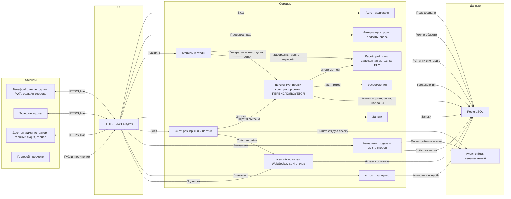
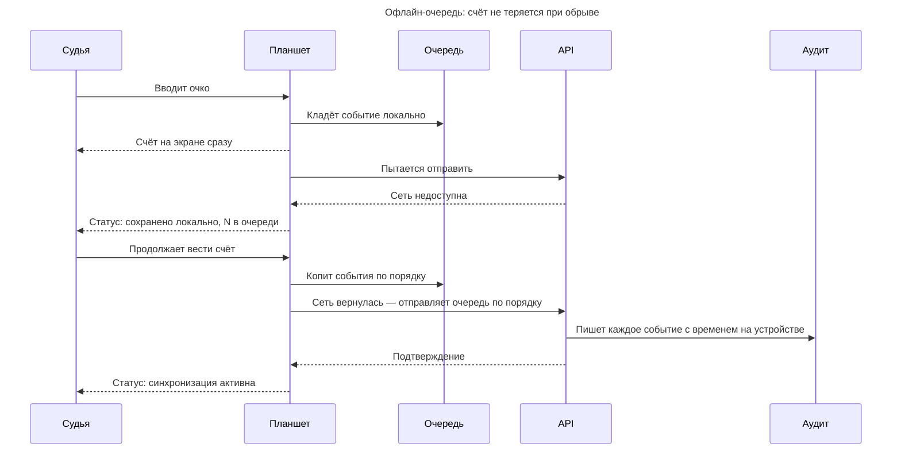
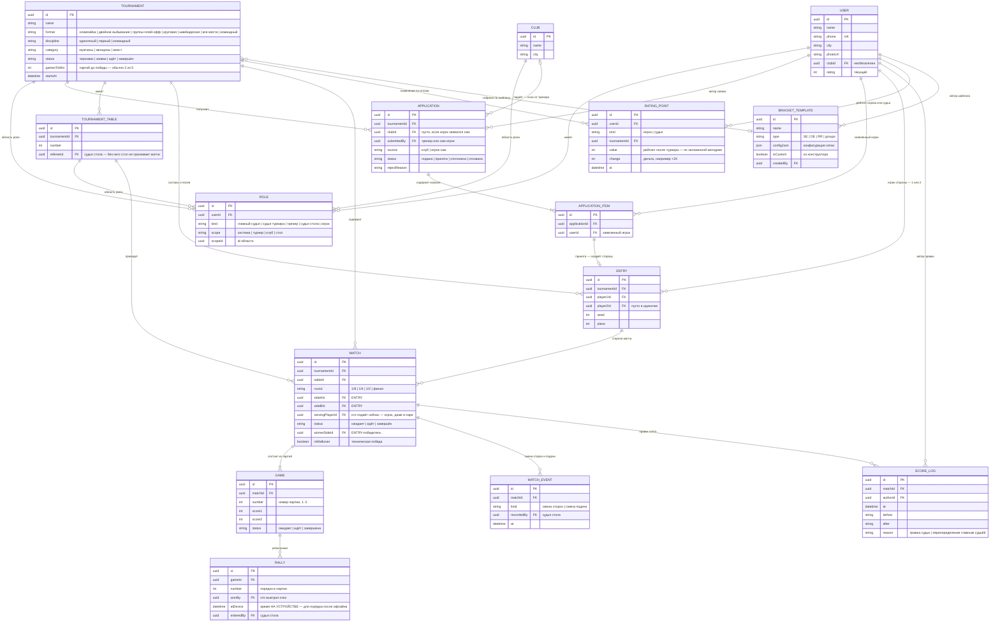

# Системный дизайн

Из чего состоит система.

- Пользовательские сценарии — [USERFLOW.md](USERFLOW.md)
- Требования — [TZ.md](TZ.md) · Дизайн — [DESIGN.md](DESIGN.md)

---

## 1. Клиенты и их форм-факторы

Форм-фактор здесь — не деталь, а требование. Он вытекает из того, **где физически
находится человек**, и определяет, что вообще можно нарисовать на экране.

| Роль | Устройство | Почему так |
|---|---|---|
| Судья стола | **планшет, ландшафт** | ведёт протокол за столом; нужен крупный счёт и много кнопок регламента одновременно |
| Игрок | **телефон** | в зале, между матчами; смотрит свой матч и аналитику |
| Главный судья, судья турнира | **десктоп** | управление турниром, назначения, модерация заявок |
| Тренер | **десктоп** | формирует список игроков, подаёт заявку |
| Гость | любое, веб | только чтение |

---

## 2. Архитектура

### Принятые решения

**Счёт и регламент — разные сервисы.** Ввод очка и смена сторон выглядят как
«кнопки на одном экране», но это разные вещи: первое меняет результат матча и
рейтинг, второе — процедурное событие. Смешивать их в одном сервисе значит
смешивать и правила отката.

**Движок — отдельный узел, хотя физически это библиотека.** Показан отдельно
потому, что он **переиспользуется** из существующей системы, и его границу важно
видеть: всё, что внутри, не переписывается. Даёт стандартные форматы **и
конструктор нестандартных сеток** (см. [TZ.md](TZ.md) §5).

**Рейтинг — по заложенной методике.** Методика единая для всех турниров и
определена в системе (ELO с фиксированными коэффициентами, см. [TZ.md](TZ.md)
§7). Это не настраиваемый на ходу движок: изменить методику можно только новой
версией системы, а не через панель. Пересчёт запускается по «Завершить турнир»,
не задваивается при повторе. Считается рейтинг игроков и судей.

**Роли:** сверху — **Администратор системы** (пользователи, организации,
настройки, контент); **Главный судья** руководит конкретным турниром (создаёт,
собирает сетку, вызывает пары, завершает); ниже — судья стола, тренер/
представитель, игрок, гость.

**Live-канал — отдельный компонент, транспорт не выбран.** Требование «счёт виден
за ≤ 1 с» — архитектурное решение (частый опрос против постоянного соединения),
и его надо принять
осознанно, а не унаследовать.

**Аутентификация и авторизация разведены.** RBAC с шестью ролями и наследованием —
ядро этого ТЗ, а не деталь входа по паролю.

---

## 3. Офлайн-очередь на планшете судьи

Единственное место, где клиент — не тонкий. Сеть в спортзале ненадёжна, а потеря
счёта недопустима.

**Ключевое правило: очередь упорядочена и идемпотентна.** Каждое событие несёт
время, снятое **на устройстве**, а не на сервере — иначе после обрыва порядок
розыгрышей восстановится неверно. Повторная отправка того же события не должна
менять счёт дважды.

---

## 4. Доменная модель

Ключевые сущности:

- **`ROLE`** — не флаг на пользователе, а связка «пользователь → роль → область»
  (система / турнир / клуб / стол). Один человек может быть тренером в клубе А,
  судьёй стола на турнире Б и игроком на турнире В одновременно.
- **`ENTRY`** — **сторона матча**: одиночка (один игрок) или пара (двое). Матч
  связывает две стороны, а не двух игроков, поэтому **парный разряд** укладывается
  в ту же модель без переделки.
- **`GAME`** — партия. Матч не хранит счёт напрямую: `3:1` — это производная от
  партий. Партии нужны и судье (таблица), и игроку (история матчей).
- **`RALLY`** — розыгрыш, одно очко. Из него строится лента последних розыгрышей
  и работает точечная отмена.
- **`MATCH_EVENT`** — процедурные события: смена сторон и смена подачи.
  Отдельно от счёта, потому что не влияют на результат.
- **`SCORE_LOG`** — неизменяемый аудит. Любая правка счёта, включая
  переопределение главным судьёй, восстановима по автору и времени.
- **`RATING_POINT`** — точка рейтинга **игрока или судьи** (`kind`). Значения
  считает внешняя система (см. раздел 2), мы храним историю для графиков.

### Ключевые решения модели

- **`GAME` — отдельная сущность.** Матч не хранит счёт напрямую: `3:1` — это
  производная от партий. Партии нужны и судье (таблица), и игроку (история).
- **`RALLY`** нужен для ленты последних розыгрышей и точечной отмены; он же
  покадровый счёт для live-трансляции и аналитики.
- **`MATCH_EVENT`** — смена сторон и подачи не влияют на счёт, но фиксируются.
- **`ENTRY` — ключ к парному разряду.** Матч связывает две стороны, каждая —
  один игрок (одиночка) или двое (пара). Посев, заявка и рейтинг работают поверх
  стороны, поэтому парный разряд лёг в модель без переделки матча.
- **Рейтинг по заложенной методике.** Методика единая и определена в системе
  (ELO, фиксированные коэффициенты). `RATING_POINT` — история значений, `kind`
  разделяет рейтинг игроков и судей.
- **`BRACKET_TEMPLATE`** — конструктор сеток сохраняет шаблоны в библиотеку.

**`RALLY.atDevice` — не украшение.** Это время, снятое на планшете, а не на
сервере. После обрыва сети очередь событий уходит пачкой, и серверное время
у всех будет почти одинаковым — порядок розыгрышей восстановится неверно.
