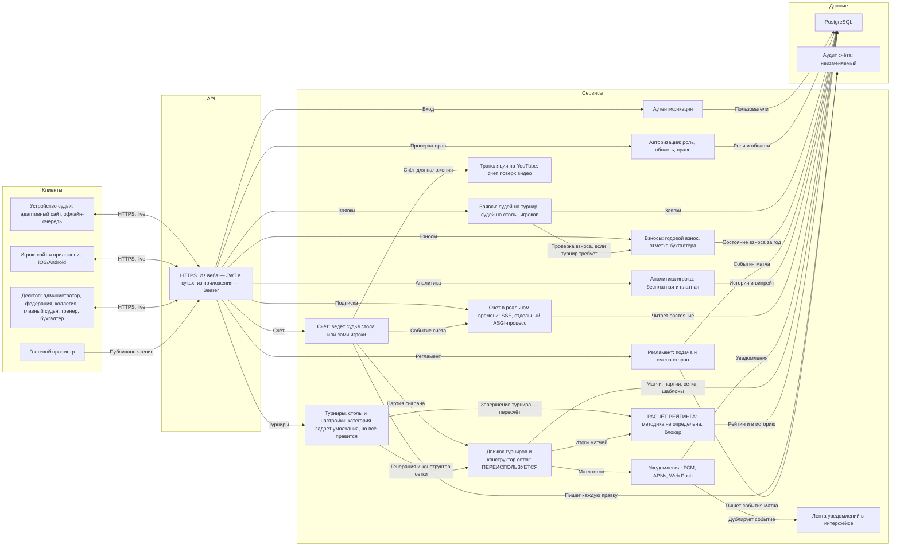
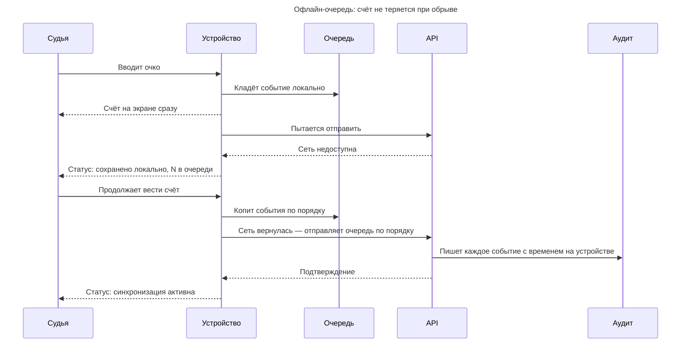
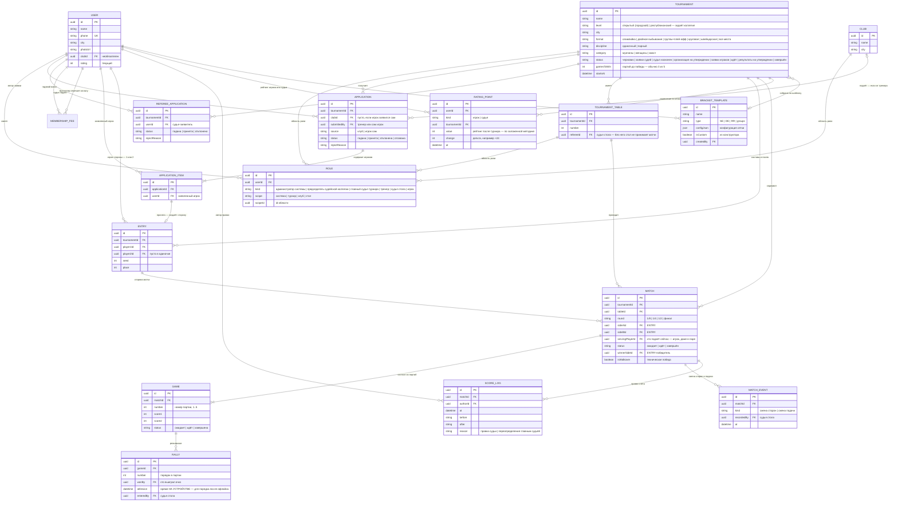

# Системный дизайн

Из чего состоит система.

- Пользовательские сценарии — [USERFLOW.md](USERFLOW.md)
- Требования — [TZ.md](TZ.md) · Дизайн — [DESIGN.md](DESIGN.md)

---

## 1. Клиенты и их форм-факторы

Форм-фактор здесь — не деталь, а требование. Он вытекает из того, **где физически
находится человек**, и определяет, что вообще можно нарисовать на экране.

| Роль | Устройство | Почему так |
|---|---|---|
| Администратор системы | **десктоп** | аккаунты, организации, настройки, публикация контента |
| Федерация | **десктоп** | полный доступ ко всему; смотрит, а не управляет |
| Председатель судейской коллегии | **десктоп** | заводит турнир, назначает судью, утверждает систему проведения и протокол |
| Главный судья турнира | **десктоп** | конструктор сетки, набор судей столов, заявки игроков, вызов пар |
| Судья стола | **адаптивный сайт, обычно планшет** | ведёт протокол за столом; нужен крупный счёт и кнопки регламента; работает и с телефона |
| Бухгалтер | **десктоп** | проверяет оплату годового взноса и отмечает её |
| Тренер, представитель | **десктоп** | формирует список игроков, подаёт заявку |
| Игрок | **сайт и приложение iOS/Android** | в зале между матчами и дома; смотрит свой матч и аналитику. На лигах и любительских **сам вводит счёт** |
| Гость | любое, веб | только чтение |

Приложение есть только у игрока. Все остальные роли работают с адаптивного
сайта, и это упирается в открытый вопрос: push в браузер это другая технология,
а вызов на стол судье нужен мгновенно (QUESTIONS 11.1).

---

## 2. Архитектура

### Принятые решения

**Счёт и регламент — разные сервисы.** Ввод очка и смена сторон выглядят как
«кнопки на одном экране», но это разные вещи: первое меняет результат матча и
рейтинг, второе — процедурное событие. Смешивать их в одном сервисе значит
смешивать и правила отката.

**Движок — отдельный узел, хотя физически это библиотека.** Показан отдельно
потому, что он **переиспользуется** из существующей системы, и его границу важно
видеть: всё, что внутри, не переписывается. Даёт стандартные форматы **и
конструктор нестандартных сеток** (см. [TZ.md](TZ.md) §5).

**Рейтинг — методика не определена, и это блокер.** Раньше здесь стояло «ELO с
фиксированными коэффициентами». Это было наше предположение, а не решение
федерации: [TZ.md](TZ.md) §7.1 ссылается на Приложение А, которого не
существует (QUESTIONS 5.1). Сервис в архитектуре остаётся — считать всё равно
придётся, — но его содержимое пока пустое, и планировать сроки по нему нельзя.
Что известно точно: пересчёт запускается не по завершении матчей, а после
утверждения итогового протокола ([TZ.md](TZ.md) §4.8), не задваивается при
повторе, и в него идут **все три категории турниров** ([TZ.md](TZ.md) §4.1).

**Роли: девять.** **Администратор системы** держит платформу и в судейство не
входит. **Федерация** видит всё и ничем не управляет — это безопасно потому, что
система именная и каждое действие записано с автором. Судейство разделено на два
уровня: **председатель судейской коллегии** заводит турнир, назначает судью по
заявке, утверждает систему проведения и итоговый протокол; **главный судья
турнира** ведёт один турнир и вдобавок сам набирает судей столов (§4.5, наше
допущение). Ниже — судья стола, бухгалтер, тренер, игрок, гость. См.
[TZ.md](TZ.md) §2.

**Категория турнира — это настройки, а не тип.** Республиканский, лига и
любительский отличаются четырьмя переключателями: судьи на столах, годовой
взнос, документы к заявке, участие коллегии ([TZ.md](TZ.md) §4.2). Категория
задаёт им умолчания, но каждый правится под конкретный турнир. Поэтому в модели
это не enum с зашитым поведением, а набор флагов на турнире: иначе любое
исключение потребует новой категории.

**Счёт вводит судья стола или сами игроки.** Там, где судей на столах нет
(лига, любительский), счёт вводит один игрок, а второй подтверждает
([TZ.md](TZ.md) §6.4). Для сервиса счёта это не два режима одного процесса, а
два разных источника с разными правилами фиксации: во втором результат не
считается принятым до подтверждения соперником. Прямой эфир и трансляция на
YouTube во втором сценарии не работают — некому вести счёт по очкам.

**Взносы — отдельный сервис.** Годовой взнос ведёт бухгалтер, а заявка игрока
проверяет его состояние, но только если турнир этого требует ([TZ.md](TZ.md)
§9.2). Отделён от заявок потому, что это деньги и учёт со своим жизненным циклом
(год, просрочка), и потому, что связь между взносом и допуском сама по себе
открытый вопрос (QUESTIONS 6.1).

**Счёт в реальном времени — отдельный компонент, транспорт не выбран.**
Обновление счёта у зрителей — архитектурное решение (частый опрос против
постоянного соединения), и его надо принять осознанно, а не унаследовать.
Работает на многих столах одновременно.

**Трансляция на YouTube — отдельный сервис.** Счёт накладывается на видео со
столов автоматически из ввода судьи (см. [TZ.md](TZ.md) §6.3), без оператора,
и встраивается на страницу турнира. Отделён от счёта, потому что это внешняя
интеграция со своим темпом и режимом сбоев.

**У игрока два канала, и это «и», а не «или».** Веб и нативное приложение под
Android и iOS — не альтернатива друг другу и не «основной и запасной». Дома и с
чужого компьютера игрок заходит на сайт, в зале между матчами — с приложения, и
это один и тот же человек в один и тот же день. Поэтому:

- оба канала **полноценные**: приложение не урезанная версия сайта, а сайт не
  заглушка «скачайте приложение». Функциональность игрока одинаковая в обоих;
- **один аккаунт, одни данные, один backend** — общие сервисы и общая база, без
  отдельного мобильного API со своей логикой;
- единственное настоящее различие — **push**: в приложении он штатный, в вебе
  это другая технология, и нужен ли он там, пока открытый вопрос (QUESTIONS
  11.1);
- на схеме это два отдельных узла внутри рамки «Игрок», а не одна строка «сайт и
  приложение»: одна строка читалась как «где-то одно из двух».

Расширенная аналитика платная — единственная точка монетизации ([TZ.md](TZ.md)
§11), и она тоже должна быть в обоих каналах.

**Аутентификация и авторизация разведены.** RBAC с девятью ролями — ядро этого
ТЗ, а не деталь входа по паролю. Роль это не глобальный флаг, а связка
пользователя, роли и области: один человек бывает тренером в клубе А, судьёй
стола на турнире Б и игроком на турнире В ([TZ.md](TZ.md) §2).

**Push-уведомления — отдельный сервис, канал не выбран.** Семь событий процесса
и их получатели перечислены в [TZ.md](TZ.md) §10.1. Нерешённое здесь не «какие
события», а «куда доставлять»: приложение есть только у игрока, остальные роли
работают с адаптивного сайта, а push в браузер это другая технология со своими
ограничениями (QUESTIONS 11.1). Вызов на стол судье нужен мгновенно, и это самое
узкое место.

---

## 3. Технологический стек

**Откуда взят.** Это стек, на котором команда уже работает: бэкенд `tt_back`
(Django + DRF, PostgreSQL, S3) и фронтенд `tt_front` (Next.js). Для платформы
ФНТ он **не подтверждён отдельным решением** — здесь он зафиксирован как
отправная точка, потому что переиспользовать знакомое дешевле, чем выбирать
заново. Если для этого проекта решено иначе, менять надо здесь.

| Слой | Чем делаем | Откуда известно |
|---|---|---|
| Бэкенд | Python 3.11, Django 4.2, Django REST Framework | `tt_back`: requirements.txt, Dockerfile |
| Запуск | gunicorn в Docker, миграции на деплое | `tt_back`: Procfile, Dockerfile |
| База | **PostgreSQL**, доступ через psycopg2, адрес из `DATABASE_URL` | `tt_back`: psycopg2-binary, dj-database-url |
| Файлы | **Cloudflare R2** — документы к заявкам, фото. S3-совместимый API, поэтому boto3 работает без правок | `tt_back`: boto3, `AWS_STORAGE_BUCKET_NAME`, `AWS_S3_ENDPOINT_URL` |
| Статика | whitenoise | `tt_back`: requirements.txt |
| Веб | Next.js 16, React 19, TypeScript, Tailwind 4 | `tt_front`: package.json |
| Приложение игрока | Android и iOS, те же сервисы и данные (§1) | [TZ.md](TZ.md) §10 |

**Почему PostgreSQL, а не что-то ещё.** Доменная модель (§5) реляционная по
сути: заявки, составы, матчи, партии и розыгрыши связаны внешними ключами, а
итоговый протокол и рейтинг считаются выборками по ним. Плюс два требования, где
реляционная база отвечает прямо: журнал правок счёта не редактируется и не
удаляется (§12 ТЗ), а рейтинг пересчитывается транзакционно после утверждения
протокола — половинчатый пересчёт недопустим.

### Фронт: где что выполняется

**Веб — Next.js 16, App Router.** У него две половины, и от того, в какой
выполняется код, зависит, что вообще возможно.

| Где | Что там | Почему |
|---|---|---|
| Статика и ISR | расписание, новости, таблица рейтинга | публичные и редко меняются; в Django за ними не ходим на каждый заход |
| Серверные компоненты (RSC) | страница турнира, сетка, состав, профиль | данные тянутся на сервере Next, в браузер приезжает готовая разметка |
| Server Actions | мутации, вызванные из браузера | выполняются на сервере Next; браузер не видит адресов Django |
| Клиентские компоненты | интерактив, формы, локальное состояние | после гидрации |

**Только из браузера — и это не выбор, а свойство технологии.** SSE
(`EventSource`), подписка на push и оптимистичный отклик не могут жить в
серверном компоненте: он отрендерился и умер, держать открытое соединение или
хранить ключ устройства ему нечем.

**А вот это выбор, и его надо сделать осознанно:** мутации через Server Actions
или напрямую из браузера в API. Через Actions — единая точка, куки и проверка
прав остаются на сервере, но появляется лишний прыжок Next → Django. Напрямую —
короче, но адреса и токены уезжают в клиент. По умолчанию склоняемся к Server
Actions, потому что JWT лежит в httpOnly-куках и на сервере с ним проще.

**Приложение — Expo (React Native).** Главное отличие: **серверной половины
здесь нет вообще**. Ни RSC, ни Server Actions, ни ISR — все экраны рендерятся на
устройстве, данные тянутся прямо из API. Вопрос «что на сервере, а что на
клиенте» тут не стоит: всё на клиенте.

Два места, где приложение расходится с вебом, и оба упираются в бэкенд:

- **Авторизация.** httpOnly-куки в приложении не работают. Токен лежит в
  `SecureStore` и уходит заголовком `Authorization`. Токен тот же, транспорт
  другой — API должен принимать оба.
- **SSE.** В React Native нет `EventSource`, нужен polyfill
  (`react-native-sse`). Сам поток тот же, что у веба.

Выкатка приложения тоже своя: EAS Build в App Store и Google Play, а правки
JavaScript уходят по воздуху через `expo-updates`, без ревью магазина.

### Счёт в реальном времени: SSE

**Server-Sent Events**, а не WebSocket. Счёт идёт в одну сторону — сервер
рассказывает клиентам, что изменилось. Обратный канал не нужен: судья
отправляет очко обычным `POST`, и смешивать это с потоком незачем. SSE проще:
это обычный HTTP-ответ, который не закрывается, он проходит через прокси без
отдельной настройки апгрейда соединения, а браузер сам переподключается при
обрыве — в зале с нестабильной сетью это не мелочь.

**Чего это стоит.** Соединение висит открытым, а синхронный воркер gunicorn
занят им целиком: сто зрителей одного турнира съедят сто воркеров, и API
встанет. Поэтому поток обслуживает **отдельный ASGI-процесс** (uvicorn), а
синхронный gunicorn остаётся под обычные запросы. Это не деталь развёртывания,
а следствие выбора: без разделения процессов SSE на Django ломает то, к чему
подключён.

Когда SSE окажется мало — если понадобится обратный канал с низкой задержкой,
например одновременное редактирование сетки, — переходим на WebSocket через
Django Channels. Сейчас такой задачи нет.

### Уведомления

Семь событий и их получатели перечислены в [TZ.md](TZ.md) §10.1. Как они
доставляются:

| Куда | Чем | Состояние |
|---|---|---|
| Приложение игрока (Android) | FCM | решено |
| Приложение игрока (iOS) | APNs | решено |
| Браузер: судьи, тренеры, коллегия, бухгалтер | Web Push по VAPID | **нужен ли — QUESTIONS 11.1** |
| Внутри интерфейса | лента уведомлений в самом приложении | решено, работает всегда |

**Лента в интерфейсе — не дубль, а основа.** Push можно не увидеть, отключить в
настройках телефона, потерять при смене устройства. Поэтому каждое событие
ложится в ленту внутри системы, а push — только способ привлечь внимание
быстрее. Тогда пропущенный push не означает потерянное действие.

Самое узкое место — вызов пары на стол: судье он нужен мгновенно, а судья
работает с адаптивного сайта. Если ответ на 11.1 будет «Web Push не нужен»,
придётся либо держать вкладку открытой и слушать тот же SSE-поток, либо
пересматривать канал.

### Деплой: Railway

**Площадка выбрана — Railway.** Не потому, что она лучшая вообще, а потому, что
под неё уже написан `tt_back`: Railway читает `Procfile` как есть, и строка
`collectstatic && migrate && gunicorn` поедет без переделки. Остальное сходится
так же — `DATABASE_URL` приходит переменной среды, а код уже берёт её через
`dj-database-url`; деплой идёт из GitHub по пушу, репозитории уже там; несколько
процессов в одном проекте — ровно то, что нужно после выбора SSE.

| Что | Где | Почему так |
|---|---|---|
| API | Railway, процесс `gunicorn` | синхронные воркеры под обычные запросы |
| SSE | Railway, отдельный сервис `uvicorn` | долгие соединения не должны занимать воркеры API (§3) |
| База | PostgreSQL от Railway | managed, `DATABASE_URL` в переменных, бэкапы на стороне площадки |
| Файлы | Cloudflare R2 | S3-совместимый, а код уже поддерживает `AWS_S3_ENDPOINT_URL`; исходящий трафик бесплатный, а фото и документы отдаются наружу |
| Статика | whitenoise из контейнера | отдельный CDN под неё не нужен |
| Сборка | образ из `Dockerfile`, тег по коммиту | |
| Откат | предыдущий деплой | миграции пишутся совместимыми назад |
| Окружения | стенд и продакшн — разные проекты Railway | разные базы, бакеты и домены, всё через переменные среды |

**Альтернатива, если Railway не подойдёт:** Render. Тот же Docker и managed
PostgreSQL, но `Procfile` он не читает — процессы описываются в `render.yaml`,
то есть появляется файл, которого сейчас нет. Поэтому вторым номером, а не
первым.

**Одна оговорка, и я оставляю её строкой, а не блоком.** В вашем же ТЗ (§1, §11,
§12) записано соответствие Закону РК №94-V о персональных данных, а он говорит,
где могут физически лежать данные игроков и документы к заявкам. Railway и R2
держат их за пределами Казахстана. Сейчас это не мешает: выбор площадки —
единственное, что придётся пересмотреть, если федерация подтвердит требование, и
переезд ограничится сменой переменных среды, потому что всё остальное в
контейнере. Записал, чтобы это всплыло на согласовании, а не на сдаче.

### Что остаётся нерешённым

- **Нужен ли Web Push в браузере** (QUESTIONS 11.1). Упирается в вызов на стол:
  судья работает с сайта, а уведомление ему нужно мгновенно.
- **Конвейер видео на YouTube.** Наложение счёта на картинку со столов без
  оператора ([TZ.md](TZ.md) §6.3) — отдельная интеграция со своим темпом и
  режимом сбоев.

---

## 4. Офлайн-очередь на устройстве судьи

Единственное место, где клиент — не тонкий. Сеть в спортзале ненадёжна, а потеря
счёта недопустима.

**Ключевое правило: очередь упорядочена и идемпотентна.** Каждое событие несёт
время, снятое **на устройстве**, а не на сервере — иначе после обрыва порядок
розыгрышей восстановится неверно. Повторная отправка того же события не должна
менять счёт дважды.

---

## 5. Доменная модель

Ключевые сущности:

- **`ROLE`** — не флаг на пользователе, а связка «пользователь → роль → область»
  (система / турнир / клуб / стол). Один человек может быть тренером в клубе А,
  судьёй стола на турнире Б и игроком на турнире В одновременно.
- **`ENTRY`** — **сторона матча**: одиночка (один игрок) или пара (двое). Матч
  связывает две стороны, а не двух игроков, поэтому **парный разряд** укладывается
  в ту же модель без переделки.
- **`GAME`** — партия. Матч не хранит счёт напрямую: `3:1` — это производная от
  партий. Партии нужны и судье (таблица), и игроку (история матчей).
- **`RALLY`** — розыгрыш, одно очко. Из него строится лента последних розыгрышей
  и работает точечная отмена.
- **`MATCH_EVENT`** — процедурные события: смена сторон и смена подачи.
  Отдельно от счёта, потому что не влияют на результат.
- **`SCORE_LOG`** — неизменяемый аудит. Любая правка счёта, включая
  переопределение главным судьёй, восстановима по автору и времени.
- **`RATING_POINT`** — точка рейтинга **игрока или судьи** (`kind`). Значения
  считает внешняя система (см. раздел 2), мы храним историю для графиков.

### Ключевые решения модели

- **`GAME` — отдельная сущность.** Матч не хранит счёт напрямую: `3:1` — это
  производная от партий. Партии нужны и судье (таблица), и игроку (история).
- **`RALLY`** нужен для ленты последних розыгрышей и точечной отмены; он же
  покадровый счёт для live-трансляции и аналитики.
- **`MATCH_EVENT`** — смена сторон и подачи не влияют на счёт, но фиксируются.
- **`ENTRY` — ключ к парному разряду.** Матч связывает две стороны, каждая —
  один игрок (одиночка) или двое (пара). Посев, заявка и рейтинг работают поверх
  стороны, поэтому парный разряд лёг в модель без переделки матча.
- **`REFEREE_APPLICATION` — отдельно от `APPLICATION`, и это осознанно.** Заявки
  внешне похожи, но `APPLICATION` — заявка **на состав**: у неё есть клуб, автор
  и список игроков (`APPLICATION_ITEM`), а принятая строка порождает `ENTRY`.
  Заявка судьи — это один человек на один турнир, без клуба, списка и стороны.
  Слить их в одну таблицу с флагом `kind` значит получить половину колонок
  всегда пустыми и две несовместимые проверки в одном месте.
- **А вот два конкурса судейства живут в одной таблице, и это не противоречие.**
  `REFEREE_APPLICATION.kind` различает заявку на главного судью и заявку на
  судейство стола (§4.5). Здесь флаг уместен ровно потому, почему он неуместен
  выше: у обеих заявок одинаковая структура — один человек, один турнир, статус
  и причина отказа. Различаются они не полями, а тем, кто рассматривает
  (`decided_by`: коллегия либо главный судья) и сколько заявок принимают.
  Пустых колонок не появляется. Напоминание: сам набор судей столов — наше
  допущение (QUESTIONS 12), и если порядок окажется другим, эта часть модели
  переделывается.
- **Категория турнира — четыре флага, а не enum с поведением.** `category`
  (республиканский, лига, любительский) только подписывает турнир; поведение
  задают `needs_table_referees`, `needs_fee`, `needs_documents`, `needs_approval`
  ([TZ.md](TZ.md) §4.2). Категория выставляет им умолчания при создании, дальше
  каждый правится отдельно. Если зашить поведение в саму категорию, любое
  исключение («лига без взноса») потребует новой категории в enum.
- **`MEMBERSHIP_FEE` — отдельная сущность, а не флаг на игроке.** У взноса свой
  год, дата оплаты и автор отметки (бухгалтер), а состояний три, а не два:
  оплачен, не оплачен, просрочен. Связи с `ENTRY` в модели намеренно нет:
  блокирует ли неоплаченный взнос заявку — открытый вопрос (QUESTIONS 6.1), и
  пока на него нет ответа, эту связь рисовать рано.
- **`GAME.entry_source` и `confirmed_by` — ввод счёта самими игроками.** Там, где
  судей на столах нет, счёт вводит один игрок, а второй подтверждает
  ([TZ.md](TZ.md) §6.4). Партия без `confirmed_at` — это заявленный, но не
  принятый результат, и в сетку он не идёт. У счёта от судьи стола этого
  состояния нет: его подтверждение и есть ввод.
- **`TOURNAMENT.status` — не украшение, а права.** Статус определяет, кто сейчас
  действует, что можно править и что видно публично (см. [TZ.md](TZ.md) §4.3).
  Два статуса — «организация на утверждении» и «результаты на утверждении» —
  это шлагбаумы судейской коллегии: без них турнир не публикуется и не попадает
  в рейтинг.
- **Рейтинг: методика не определена** (QUESTIONS 5.1), поэтому модель хранит
  результат расчёта, а не его правила. `RATING_POINT` — история значений, `kind`
  разделяет рейтинг игроков и судей. Так выбор методики останется правкой
  сервиса, а не переездом данных.
- **`BRACKET_TEMPLATE`** — конструктор сеток сохраняет шаблоны в библиотеку.

**`RALLY.atDevice` — не украшение.** Это время, снятое на устройстве судьи, а не на
сервере. После обрыва сети очередь событий уходит пачкой, и серверное время
у всех будет почти одинаковым — порядок розыгрышей восстановится неверно.
