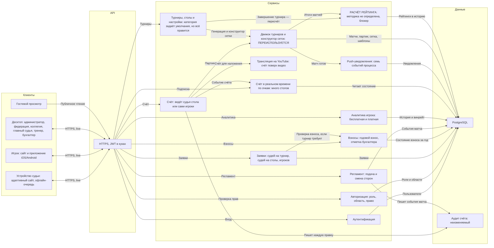
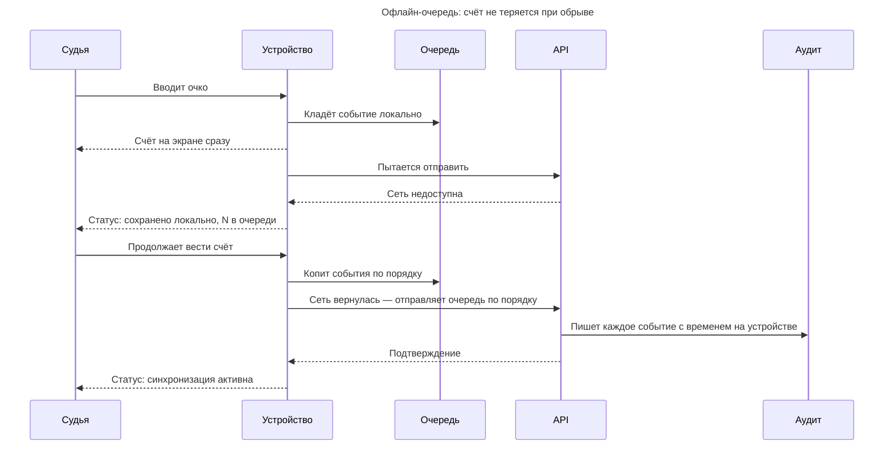

# Системный дизайн

Из чего состоит система.

- Пользовательские сценарии — [USERFLOW.md](USERFLOW.md)
- Требования — [TZ.md](TZ.md) · Дизайн — [DESIGN.md](DESIGN.md)

---

## 1. Клиенты и их форм-факторы

Форм-фактор здесь — не деталь, а требование. Он вытекает из того, **где физически
находится человек**, и определяет, что вообще можно нарисовать на экране.

| Роль | Устройство | Почему так |
|---|---|---|
| Администратор системы | **десктоп** | аккаунты, организации, настройки, публикация контента |
| Федерация | **десктоп** | полный доступ ко всему; смотрит, а не управляет |
| Председатель судейской коллегии | **десктоп** | заводит турнир, назначает судью, утверждает систему проведения и протокол |
| Главный судья турнира | **десктоп** | конструктор сетки, набор судей столов, заявки игроков, вызов пар |
| Судья стола | **адаптивный сайт, обычно планшет** | ведёт протокол за столом; нужен крупный счёт и кнопки регламента; работает и с телефона |
| Бухгалтер | **десктоп** | проверяет оплату годового взноса и отмечает её |
| Тренер, представитель | **десктоп** | формирует список игроков, подаёт заявку |
| Игрок | **сайт и приложение iOS/Android** | в зале между матчами и дома; смотрит свой матч и аналитику. На лигах и любительских **сам вводит счёт** |
| Гость | любое, веб | только чтение |

Приложение есть только у игрока. Все остальные роли работают с адаптивного
сайта, и это упирается в открытый вопрос: push в браузер это другая технология,
а вызов на стол судье нужен мгновенно (QUESTIONS 11.1).

---

## 2. Архитектура

### Принятые решения

**Счёт и регламент — разные сервисы.** Ввод очка и смена сторон выглядят как
«кнопки на одном экране», но это разные вещи: первое меняет результат матча и
рейтинг, второе — процедурное событие. Смешивать их в одном сервисе значит
смешивать и правила отката.

**Движок — отдельный узел, хотя физически это библиотека.** Показан отдельно
потому, что он **переиспользуется** из существующей системы, и его границу важно
видеть: всё, что внутри, не переписывается. Даёт стандартные форматы **и
конструктор нестандартных сеток** (см. [TZ.md](TZ.md) §5).

**Рейтинг — методика не определена, и это блокер.** Раньше здесь стояло «ELO с
фиксированными коэффициентами». Это было наше предположение, а не решение
федерации: [TZ.md](TZ.md) §7.1 ссылается на Приложение А, которого не
существует (QUESTIONS 5.1). Сервис в архитектуре остаётся — считать всё равно
придётся, — но его содержимое пока пустое, и планировать сроки по нему нельзя.
Что известно точно: пересчёт запускается не по завершении матчей, а после
утверждения итогового протокола ([TZ.md](TZ.md) §4.8), не задваивается при
повторе, и в него идут **все три категории турниров** ([TZ.md](TZ.md) §4.1).

**Роли: девять.** **Администратор системы** держит платформу и в судейство не
входит. **Федерация** видит всё и ничем не управляет — это безопасно потому, что
система именная и каждое действие записано с автором. Судейство разделено на два
уровня: **председатель судейской коллегии** заводит турнир, назначает судью по
заявке, утверждает систему проведения и итоговый протокол; **главный судья
турнира** ведёт один турнир и вдобавок сам набирает судей столов (§4.5, наше
допущение). Ниже — судья стола, бухгалтер, тренер, игрок, гость. См.
[TZ.md](TZ.md) §2.

**Категория турнира — это настройки, а не тип.** Республиканский, лига и
любительский отличаются четырьмя переключателями: судьи на столах, годовой
взнос, документы к заявке, участие коллегии ([TZ.md](TZ.md) §4.2). Категория
задаёт им умолчания, но каждый правится под конкретный турнир. Поэтому в модели
это не enum с зашитым поведением, а набор флагов на турнире: иначе любое
исключение потребует новой категории.

**Счёт вводит судья стола или сами игроки.** Там, где судей на столах нет
(лига, любительский), счёт вводит один игрок, а второй подтверждает
([TZ.md](TZ.md) §6.4). Для сервиса счёта это не два режима одного процесса, а
два разных источника с разными правилами фиксации: во втором результат не
считается принятым до подтверждения соперником. Прямой эфир и трансляция на
YouTube во втором сценарии не работают — некому вести счёт по очкам.

**Взносы — отдельный сервис.** Годовой взнос ведёт бухгалтер, а заявка игрока
проверяет его состояние, но только если турнир этого требует ([TZ.md](TZ.md)
§9.2). Отделён от заявок потому, что это деньги и учёт со своим жизненным циклом
(год, просрочка), и потому, что связь между взносом и допуском сама по себе
открытый вопрос (QUESTIONS 6.1).

**Счёт в реальном времени — отдельный компонент, транспорт не выбран.**
Обновление счёта у зрителей — архитектурное решение (частый опрос против
постоянного соединения), и его надо принять осознанно, а не унаследовать.
Работает на многих столах одновременно.

**Трансляция на YouTube — отдельный сервис.** Счёт накладывается на видео со
столов автоматически из ввода судьи (см. [TZ.md](TZ.md) §6.3), без оператора,
и встраивается на страницу турнира. Отделён от счёта, потому что это внешняя
интеграция со своим темпом и режимом сбоев.

**Мобильное приложение игрока — отдельный клиент, общий backend.** Приложение
под Android и iOS работает на тех же сервисах и данных, что и сайт; игрок
пользуется и сайтом, и приложением. Расширенная аналитика платная — единственная
точка монетизации (см. [TZ.md](TZ.md) §11).

**Аутентификация и авторизация разведены.** RBAC с девятью ролями — ядро этого
ТЗ, а не деталь входа по паролю. Роль это не глобальный флаг, а связка
пользователя, роли и области: один человек бывает тренером в клубе А, судьёй
стола на турнире Б и игроком на турнире В ([TZ.md](TZ.md) §2).

**Push-уведомления — отдельный сервис, канал не выбран.** Семь событий процесса
и их получатели перечислены в [TZ.md](TZ.md) §10.1. Нерешённое здесь не «какие
события», а «куда доставлять»: приложение есть только у игрока, остальные роли
работают с адаптивного сайта, а push в браузер это другая технология со своими
ограничениями (QUESTIONS 11.1). Вызов на стол судье нужен мгновенно, и это самое
узкое место.

---

## 3. Офлайн-очередь на устройстве судьи

Единственное место, где клиент — не тонкий. Сеть в спортзале ненадёжна, а потеря
счёта недопустима.

**Ключевое правило: очередь упорядочена и идемпотентна.** Каждое событие несёт
время, снятое **на устройстве**, а не на сервере — иначе после обрыва порядок
розыгрышей восстановится неверно. Повторная отправка того же события не должна
менять счёт дважды.

---

## 4. Доменная модель

Ключевые сущности:

- **`ROLE`** — не флаг на пользователе, а связка «пользователь → роль → область»
  (система / турнир / клуб / стол). Один человек может быть тренером в клубе А,
  судьёй стола на турнире Б и игроком на турнире В одновременно.
- **`ENTRY`** — **сторона матча**: одиночка (один игрок) или пара (двое). Матч
  связывает две стороны, а не двух игроков, поэтому **парный разряд** укладывается
  в ту же модель без переделки.
- **`GAME`** — партия. Матч не хранит счёт напрямую: `3:1` — это производная от
  партий. Партии нужны и судье (таблица), и игроку (история матчей).
- **`RALLY`** — розыгрыш, одно очко. Из него строится лента последних розыгрышей
  и работает точечная отмена.
- **`MATCH_EVENT`** — процедурные события: смена сторон и смена подачи.
  Отдельно от счёта, потому что не влияют на результат.
- **`SCORE_LOG`** — неизменяемый аудит. Любая правка счёта, включая
  переопределение главным судьёй, восстановима по автору и времени.
- **`RATING_POINT`** — точка рейтинга **игрока или судьи** (`kind`). Значения
  считает внешняя система (см. раздел 2), мы храним историю для графиков.

```mermaid
erDiagram
    USER ||--o{ ROLE : "имеет"
    TOURNAMENT ||--o{ ROLE : "область роли"
    CLUB ||--o{ ROLE : "область роли"
    TOURNAMENT_TABLE ||--o{ ROLE : "область роли"

    CLUB |o--o{ APPLICATION : "подаёт — если от тренера"
    USER ||--o{ APPLICATION : "автор заявки"
    TOURNAMENT ||--o{ APPLICATION : "получает"
    TOURNAMENT ||--o{ REFEREE_APPLICATION : "конкурс судейства"
    USER ||--o{ REFEREE_APPLICATION : "судья подаёт"
    APPLICATION ||--|{ APPLICATION_ITEM : "содержит игроков"
    USER ||--o{ APPLICATION_ITEM : "заявленный игрок"
    APPLICATION_ITEM ||--o| ENTRY : "принята — создаёт сторону"

    TOURNAMENT ||--o{ TOURNAMENT_TABLE : "имеет"
    TOURNAMENT ||--o{ ENTRY : "составы и посев"
    TOURNAMENT ||--o{ MATCH : "содержит"

    USER ||--o{ ENTRY : "игрок стороны — 1 или 2"
    ENTRY ||--o{ MATCH : "сторона матча"
    TOURNAMENT_TABLE ||--o{ MATCH : "проводит"

    MATCH ||--|{ GAME : "состоит из партий"
    GAME ||--o{ RALLY : "розыгрыши"
    MATCH ||--o{ MATCH_EVENT : "смена сторон и подачи"
    MATCH ||--o{ SCORE_LOG : "правки счёта"
    USER ||--o{ SCORE_LOG : "автор правки"

    USER ||--o{ RATING_POINT : "рейтинг игрока или судьи"
    TOURNAMENT ||--o{ RATING_POINT : "изменение по итогам"
    TOURNAMENT }o--o| BRACKET_TEMPLATE : "собрана по шаблону"
    USER ||--o{ BRACKET_TEMPLATE : "автор шаблона"

    USER {
        uuid id PK
        string name
        string phone UK
        string city
        string photoUrl
        uuid clubId FK "необязателен"
        int rating "текущий"
    }
    ROLE {
        uuid id PK
        uuid userId FK
        string kind "администратор системы | председатель судейской коллегии | главный судья турнира | тренер | судья стола | игрок"
        string scope "система | турнир | клуб | стол"
        uuid scopeId "id области"
    }
    CLUB {
        uuid id PK
        string name
        string city
    }
    TOURNAMENT {
        uuid id PK
        string name
        string level "открытый (городской) | республиканский — задаёт коллегия"
        string city
        string format "олимпийка | двойное выбывание | группы+плей-офф | круговая | швейцарская | все места"
        string discipline "одиночный | парный"
        string category "мужчины | женщины | микст"
        string status "черновик | заявки судей | судья назначен | организация на утверждении | заявки игроков | идёт | результаты на утверждении | завершён"
        int gamesToWin "партий до победы — обычно 3 из 5"
        datetime startsAt
    }
    REFEREE_APPLICATION {
        uuid id PK
        uuid tournamentId FK
        uuid userId FK "судья-заявитель"
        string status "подана | принята | отклонена"
        string rejectReason
    }
    TOURNAMENT_TABLE {
        uuid id PK
        uuid tournamentId FK
        int number
        uuid refereeId FK "судья стола — без него стол не принимает матчи"
    }
    APPLICATION {
        uuid id PK
        uuid tournamentId FK
        uuid clubId FK "пусто, если игрок заявился сам"
        uuid submittedBy FK "тренер или сам игрок"
        string source "клуб | игрок сам"
        string status "подана | принята | отклонена | отозвана"
        string rejectReason
    }
    APPLICATION_ITEM {
        uuid id PK
        uuid applicationId FK
        uuid userId FK "заявленный игрок"
    }
    ENTRY {
        uuid id PK
        uuid tournamentId FK
        uuid player1Id FK
        uuid player2Id FK "пусто в одиночке"
        int seed
        int place
    }
    MATCH {
        uuid id PK
        uuid tournamentId FK
        uuid tableId FK
        string round "1/8 | 1/4 | 1/2 | финал"
        uuid sideAId FK "ENTRY"
        uuid sideBId FK "ENTRY"
        uuid servingPlayerId FK "кто подаёт сейчас — игрок, даже в паре"
        string status "ожидает | идёт | завершён"
        uuid winnerSideId FK "ENTRY-победитель"
        boolean isWalkover "техническая победа"
    }
    GAME {
        uuid id PK
        uuid matchId FK
        int number "номер партии, 1..5"
        int score1
        int score2
        string status "ожидает | идёт | завершена"
    }
    RALLY {
        uuid id PK
        uuid gameId FK
        int number "порядок в партии"
        uuid wonBy FK "кто выиграл очко"
        datetime atDevice "время НА УСТРОЙСТВЕ — для порядка после офлайна"
        uuid enteredBy FK "судья стола"
    }
    MATCH_EVENT {
        uuid id PK
        uuid matchId FK
        string kind "смена сторон | смена подачи"
        uuid recordedBy FK "судья стола"
        datetime at
    }
    SCORE_LOG {
        uuid id PK
        uuid matchId FK
        uuid authorId FK
        datetime at
        string before
        string after
        string reason "правка судьи | переопределение главным судьёй"
    }
    RATING_POINT {
        uuid id PK
        uuid userId FK
        string kind "игрок | судья"
        uuid tournamentId FK
        int value "рейтинг после турнира — по заложенной методике"
        int change "дельта, например +24"
        datetime at
    }
    BRACKET_TEMPLATE {
        uuid id PK
        string name
        string type "SE | DE | RR | groups"
        json configJson "конфигурация сетки"
        boolean isCustom "из конструктора"
        uuid createdBy FK
    }
```

### Ключевые решения модели

- **`GAME` — отдельная сущность.** Матч не хранит счёт напрямую: `3:1` — это
  производная от партий. Партии нужны и судье (таблица), и игроку (история).
- **`RALLY`** нужен для ленты последних розыгрышей и точечной отмены; он же
  покадровый счёт для live-трансляции и аналитики.
- **`MATCH_EVENT`** — смена сторон и подачи не влияют на счёт, но фиксируются.
- **`ENTRY` — ключ к парному разряду.** Матч связывает две стороны, каждая —
  один игрок (одиночка) или двое (пара). Посев, заявка и рейтинг работают поверх
  стороны, поэтому парный разряд лёг в модель без переделки матча.
- **`REFEREE_APPLICATION` — отдельно от `APPLICATION`, и это осознанно.** Заявки
  внешне похожи, но `APPLICATION` — заявка **на состав**: у неё есть клуб, автор
  и список игроков (`APPLICATION_ITEM`), а принятая строка порождает `ENTRY`.
  Заявка судьи — это один человек на один турнир, без клуба, списка и стороны.
  Слить их в одну таблицу с флагом `kind` значит получить половину колонок
  всегда пустыми и две несовместимые проверки в одном месте.
- **`TOURNAMENT.status` — не украшение, а права.** Статус определяет, кто сейчас
  действует, что можно править и что видно публично (см. [TZ.md](TZ.md) §4.1).
  Два статуса — «организация на утверждении» и «результаты на утверждении» —
  это шлагбаумы судейской коллегии: без них турнир не публикуется и не попадает
  в рейтинг.
- **Рейтинг по заложенной методике.** Методика единая и определена в системе
  (ELO, фиксированные коэффициенты). `RATING_POINT` — история значений, `kind`
  разделяет рейтинг игроков и судей.
- **`BRACKET_TEMPLATE`** — конструктор сеток сохраняет шаблоны в библиотеку.

**`RALLY.atDevice` — не украшение.** Это время, снятое на устройстве судьи, а не на
сервере. После обрыва сети очередь событий уходит пачкой, и серверное время
у всех будет почти одинаковым — порядок розыгрышей восстановится неверно.
