# User Flow

Кто что делает в системе.

- Системный дизайн — отдельно: [ARCHITECTURE.md](ARCHITECTURE.md)
- Требования: [TZ.md](TZ.md) · Дизайн: [DESIGN.md](DESIGN.md)
- Исходники диаграмм: [diagrams/](diagrams/) · сборка: `diagrams/build.ps1`

> Диаграммы на **[D2](https://d2lang.com)** — раскладку делает движок, а не я.
> Mermaid ниже оставлен как текстовая спецификация: правится в PR, рендерится
> без сборки.

## Как читать

Сначала иерархия (кто кого старше), потом жизненный цикл (что происходит
в целом), потом ролевые флоу — что видит и делает **конкретный человек**.

Цвета: зелёный — шаги переиспользуемого движка и успешные исходы, жёлтый —
развилки, красный — блокировки и отказы.

## Что здесь показано, а что нет

Республиканский календарь ФНТ РК состоит из **трёх категорий** соревнований, и
различаются они прежде всего тем, **кто подаёт заявку** ([TZ.md](TZ.md) §4.1,
§8.2): главные старты заявляет старший тренер региона, Евразийскую лигу —
администратор клуба (командой), на открытые турниры игрок заявляется сам. У
каждого старта календаря ниже свой сценарий.

Клубные турниры (лига внутри клуба, любительские) идут короче: там нет судей на
столах, не участвует судейская коллегия, а значит нет ни конкурса судей, ни
утверждения протокола. В рейтинг при этом могут идти и они.

Как именно проходит турнир без судей на столах, здесь не показано: кто вводит
счёт и что заменяет утверждение протокола перед пересчётом рейтинга, решается
при обследовании ([TZ.md](TZ.md) §13.1). Рисовать этот путь сейчас значило бы
выдумать его.

## Иерархия ролей


## Сценарии по каждому турниру календаря

Семь колонок — семь путей. Прежняя общая схема «полный ход турнира» отменена:
там ход был один на всех, а различие сводилось к типу управления. Здесь у
каждого старта календаря свой сценарий, и видно, чем он отличается от соседнего.

Серым помечены **открытые вопросы к федерации** — места, где правил у нас пока
нет и путь нарисован до той точки, дальше которой начались бы догадки.

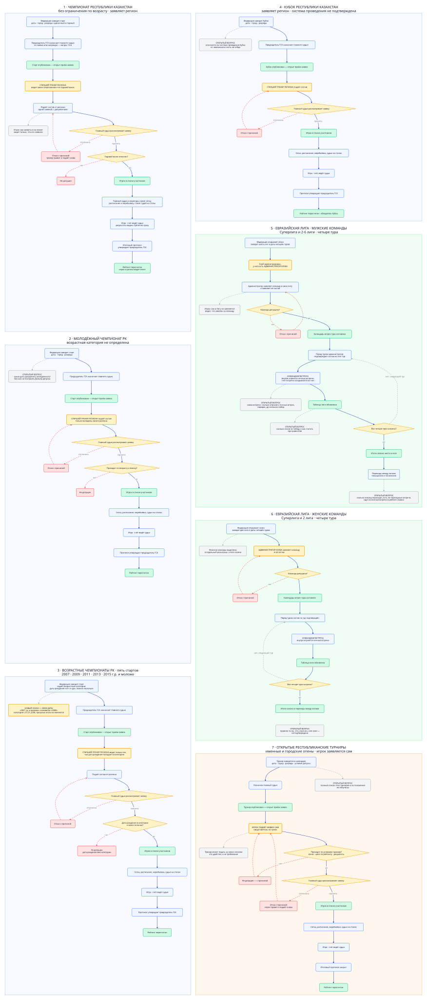

### 1. Чемпионат Республики Казахстан

Без ограничения по возрасту, разряды одиночный и парный.

1. Федерация заводит старт: даты, город, разряды.
2. Коллегия проводит конкурс судей и назначает главного судью. Публично старт
   ещё не виден.
3. Старт публикуется, открывается приём заявок.
4. **Старший тренер региона** видит своих спортсменов и состояние их годового
   взноса — иначе он отправляет список из пятнадцати человек вслепую.
5. Подаёт состав от региона одной заявкой, с документами.
6. Игрок сам заявиться не может: он видит только, что его заявили.
7. Главный судья рассматривает заявку; отклонённая возвращается с причиной,
   тренер правит и подаёт снова, пока приём открыт.
8. Не оплачен годовой взнос — не допущен.
9. Состав собран → сетка, расписание, судьи на столах → игра → итоговый
   протокол утверждает председатель коллегии → рейтинг пересчитан.

### 2. Молодёжный чемпионат РК

Ход тот же, но **возрастная граница не определена** — ни в перечне федерации,
ни в пояснениях (вопрос 11.9 в [QUESTIONS.md](QUESTIONS.md)). Без неё не
построить фильтр допуска, поэтому на схеме этот шаг стоит открытым вопросом.

### 3. Возрастные чемпионаты РК — пять стартов

2007, 2009, 2011, 2013 и 2015 г.р. и моложе. Ход одинаковый, отличается только
граница года — и она **сдвигается каждый сезон на +1**: старт «2007 г.р. и
моложе» в следующем сезоне становится «2008 г.р. и моложе».

Поэтому в системе хранится сезон и правило допуска, а название собирается из
них. Старший тренер региона видит в списке только тех, кто проходит по году
рождения; остальные ему просто не предлагаются.

### 4. Кубок Республики Казахстан

Заявляет регион, как и на чемпионатах. **Открытый вопрос:** отличается ли
система проведения Кубка от чемпионата и есть ли отбор — в присланных
материалах этого нет.

### 5–6. Евразийская лига — мужские и женские команды

Мужская: Суперлига и лиги со 2-й по 6-ю. Женская: Суперлига и 2 лига (женские
команды выделены в отдельный розыгрыш с этого сезона). Обе идут **в четыре
тура**, участник — **команда клуба**.

1. Федерация открывает сезон: заводит лиги и даты четырёх туров.
2. Клуб зарегистрирован, у него есть **администратор клуба**.
3. Администратор заявляет команду в свою лигу и заявляет её состав. Игрок сам в
   Лигу не заявляется — он видит, что заявлен за команду.
4. Перед каждым туром администратор подтверждает состав на этот тур.
5. Играются командные встречи: внутри встречи идут личные встречи, счёт встречи
   складывается из них.
6. Таблица лиги накапливается по всем четырём турам, после четвёртого — итоги
   сезона и переходы между лигами.

Это самая непроработанная категория. Не получены (вопросы 11.1–11.5): схема
командной встречи, начисление очков, правила перехода между лигами, лимиты
состава и идут ли личные встречи внутри командной в личный рейтинг игрока. На
схеме эти места помечены серым.

### 7. Открытые республиканские турниры

Именные и городские опены. Самый короткий путь: между игроком и турниром нет ни
региона, ни клуба — **игрок подаёт заявку сам**, тренер может подать за своих
списком, но это удобство, а не требование. Допуск проверяется по условиям
турнира: годовой взнос, ценз по рейтингу, документы — если организатор их
включил.

Полный список этих турниров и их положения у нас не получены: в присланном
перечне раздел обрезан, названия («Памяти Вицкевича», «Мангистау кап»,
«Бурабай Опен») записаны на слух.

### Обзор жизненного цикла

Если нужен обзор без деталей:

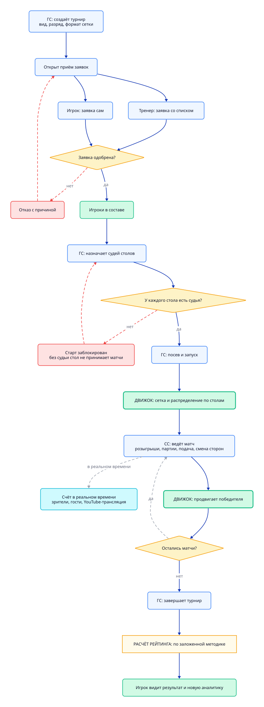

## Управляющие роли — десктоп

> **Схемы ниже отстают от перечня ролей.** Федерация прислала документ «Роли и
> их функционал» — четырнадцать ролей, он перенесён в [TZ.md](TZ.md) §2 и в
> схему иерархии выше. Микрофлоу в этом разделе (`flow-adm`, `flow-psk`,
> `flow-head`, `flow-coach`, `flow-buh`, `flow-table-judge`, `flow-player`)
> нарисованы под прежние названия ролей и пока не переписаны. Кроме
> переименований там появляются три роли, которых на схемах нет вовсе:
> **главный секретарь соревнований**, **заместитель главного судьи** и
> **инспектор / супервайзер** — а по двум последним функционал в документе
> федерации не заполнен (вопрос 12.1 в [QUESTIONS.md](QUESTIONS.md)).

Раньше эти роли жили на одной схеме. Разнесли по отдельным: сквозной путь
показывает жизненный цикл выше, а здесь у каждой роли свой микрофлоу, и их
удобно читать и править по одному.

У председателя два шлагбаума: система проведения утверждается **до**
публикации, итоговый протокол **после** игры. Всё, что между ними, — зона
главного судьи турнира. Решение в обоих случаях принимает судья, председатель
его утверждает.

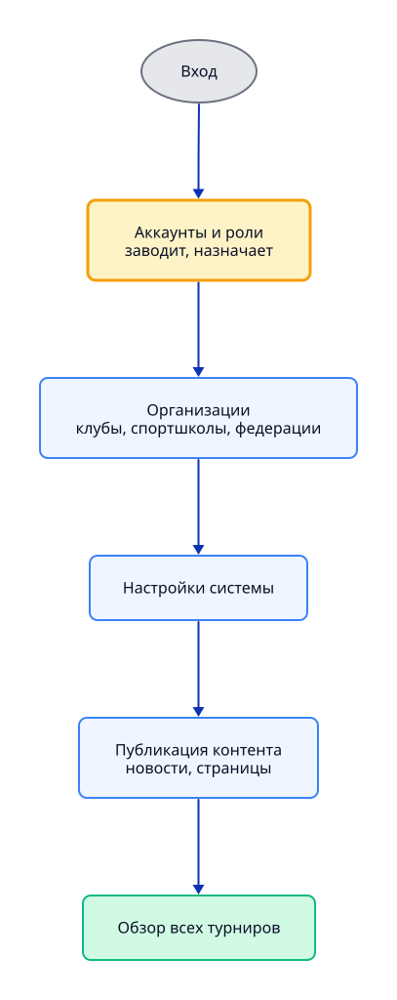

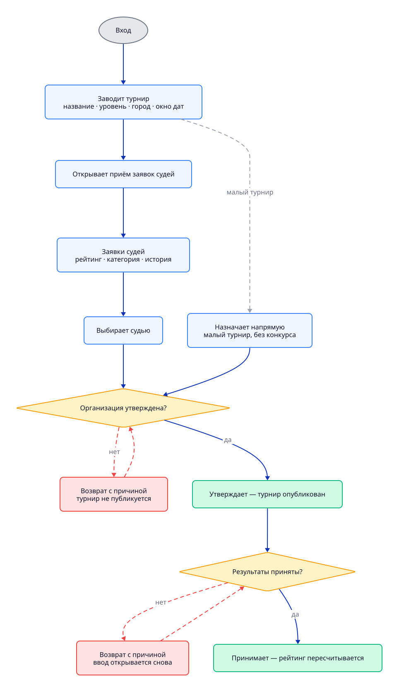

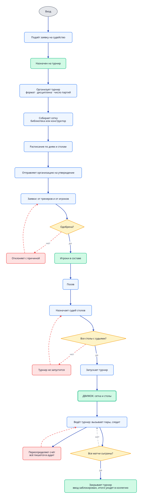

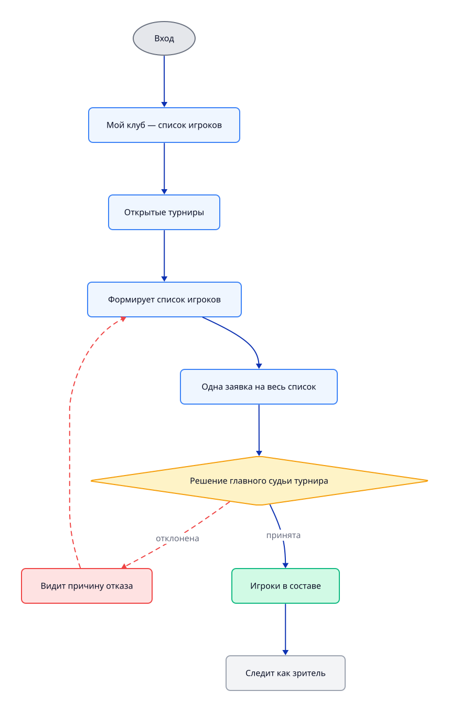

## Бухгалтер — взносы

Красным помечена блокировка заявки при неоплаченном взносе. Это **наше
допущение**, у федерации оно не подтверждено (см. [QUESTIONS.md](QUESTIONS.md)
6.1); там же открыт вопрос, отмечает ли бухгалтер оплату руками или система
принимает платежи сама.

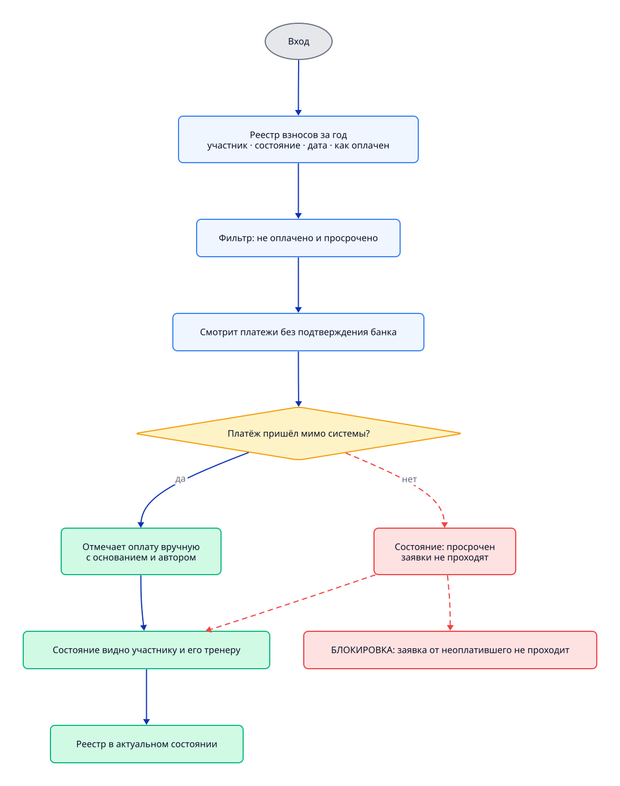

## Судья стола — адаптивный сайт

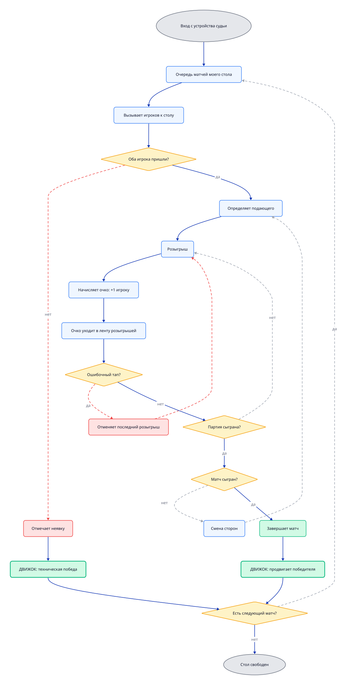

Обрыв сети идёт **параллельно** всему циклу выше:

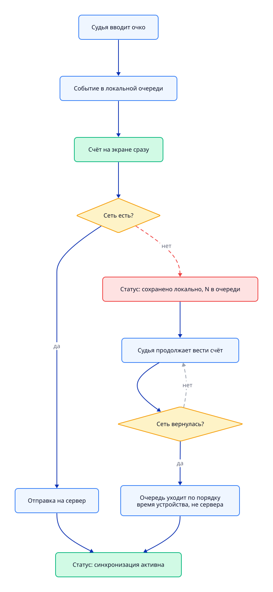

Что происходит, если во время обрыва один и тот же матч изменили с двух
устройств, схема не показывает: правило разрешения расхождений ещё не принято
([TZ.md](TZ.md) §13.1).

## Игрок — сайт и приложение

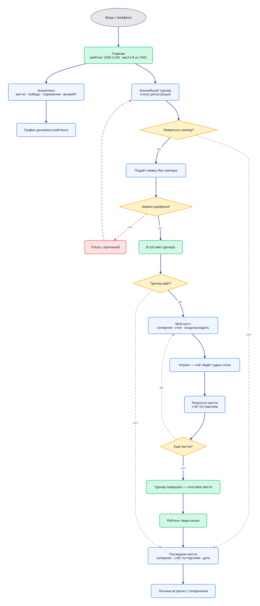

---

Ниже — то же самое в Mermaid, как текстовая спецификация.

## Три сквозных правила

Зафиксированы в [TZ.md](TZ.md) (§4.1, §4.5, §8):

- **Заявка тренера** — одна заявка на **список игроков**, решение принимается по заявке целиком.
- **Самостоятельная заявка** — игрок может заявиться **сам**, без тренера, на открытые турниры.
- **Судья на столе** — **матч не стартует, пока на стол не назначен судья стола.** Блокирующее правило, но только на **республиканских** турнирах: в лигах и любительских судей на столах нет, и там оно не действует.

## Ограничения рендерера

- Никаких ` `, HTML-тегов и эмодзи в подписях.
- ID узлов — camelCase, без подчёркиваний.
- Зарезервированы: `end`, `subgraph`, `graph`, **`call`** (callback-директива).
- В sequence-диаграммах **не работают** `Note`, `alt`, `loop`, `opt` — молча выбрасываются.

---

# Обзор

## Иерархия ролей

Сплошная стрелка — наследование прав: вышестоящая роль может всё, что может
нижестоящая. Пунктиром показано то, что правами не является: администратор
заводит учётные записи, но не решает, кто судит; федерация видит всё, но не
управляет.

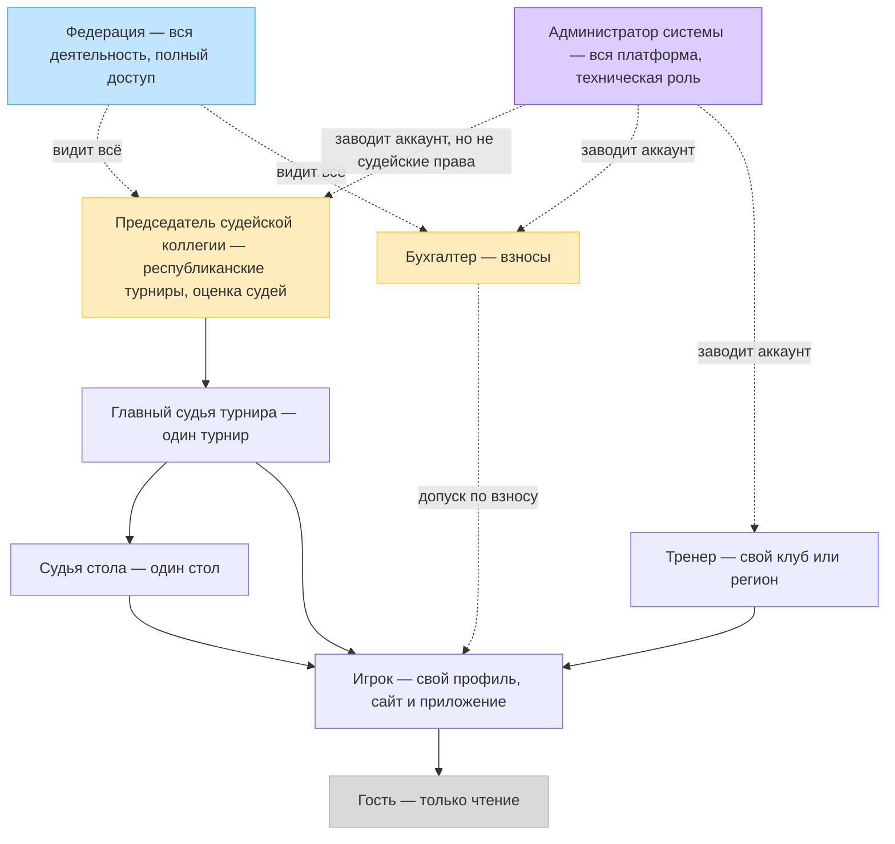

## Жизненный цикл турнира

Сквозной сценарий через все роли. ПСК — председатель судейской коллегии,
ГС — главный судья турнира, СС — судья стола.

**Два шлагбаума коллегии:** система проведения утверждается до публикации,
итоговый протокол после игры. Первый решает, состоится ли турнир в таком виде, второй
решает, попадёт ли он в рейтинг.

```mermaid
flowchart TD
    createT["ПСК заводит турнир: название, уровень, город, окно дат"]
    openRef["Открыт приём заявок судей"]
    refApply["Судья подаёт заявку на судейство"]
    pickRef["ПСК выбирает судью: рейтинг, категория, история"]
    organize["ГС выбирает систему проведения: формат, дисциплина, расписание, столы"]
    gateOrg{"ПСК: система проведения утверждена?"}
    rework["Возврат с причиной — турнир не публикуется"]
    publish["Турнир опубликован, открыт приём заявок игроков"]
    coachApply["Тренер подаёт заявку со списком игроков"]
    selfApply["Игрок подаёт заявку сам"]
    review{"ГС: заявка одобрена?"}
    rejected["Отказ с причиной"]
    participants["Стороны (одиночки/пары) заявлены"]
    assignTable["ГС назначает судей столов"]
    refGate{"У каждого стола есть судья?"}
    blockStart["Старт заблокирован"]
    seeding["ГС: посев и запуск"]
    engineGen[["Движок генерирует сетку и распределяет столы"]]
    playMatch["СС ведёт матч: партии, подача, регламент"]
    engineAdv[["Движок продвигает победителя"]]
    more{"Остались матчи?"}
    closeT["ГС формирует итоговый протокол — ввод заблокирован"]
    gateRes{"ПСК: итоговый протокол утверждён?"}
    fixRes["Возврат с причиной — ввод открыт, судья исправляет"]
    engineRating[["Рейтинг пересчитывается по заложенной методике: игроки и судьи"]]
    analytics["Игрок видит результат и обновлённую аналитику"]
    live["Счёт в реальном времени: игроки, зрители, гости, YouTube"]
    override["ГС переопределяет счёт"]

    createT --> openRef
    openRef --> refApply
    refApply --> pickRef
    pickRef --> organize
    organize --> gateOrg
    gateOrg -->|"Нет"| rework
    rework --> organize
    gateOrg -->|"Да"| publish
    publish --> coachApply
    publish --> selfApply
    coachApply --> review
    selfApply --> review
    review -->|"Нет"| rejected
    rejected --> publish
    review -->|"Да"| participants
    participants --> assignTable
    assignTable --> refGate
    refGate -->|"Нет"| blockStart
    blockStart --> assignTable
    refGate -->|"Да"| seeding
    seeding --> engineGen
    engineGen --> playMatch
    playMatch --> engineAdv
    engineAdv --> more
    more -->|"Да"| playMatch
    more -->|"Нет"| closeT
    closeT --> gateRes
    gateRes -->|"Нет"| fixRes
    fixRes --> closeT
    gateRes -->|"Да"| engineRating
    engineRating --> analytics
    playMatch -.->|"В реальном времени"| live
    override -.->|"Пишется в аудит"| playMatch

    style engineGen fill:#DCCCFF,stroke:#874FFF
    style engineAdv fill:#DCCCFF,stroke:#874FFF
    style engineRating fill:#DCCCFF,stroke:#874FFF
    style gateOrg fill:#FFECBD,stroke:#FFC943
    style gateRes fill:#FFECBD,stroke:#FFC943
    style review fill:#FFECBD,stroke:#FFC943
    style refGate fill:#FFECBD,stroke:#FFC943
    style more fill:#FFECBD,stroke:#FFC943
    style rework fill:#FFCDC2,stroke:#FF7556
    style fixRes fill:#FFCDC2,stroke:#FF7556
    style rejected fill:#FFCDC2,stroke:#FF7556
    style blockStart fill:#FFCDC2,stroke:#FF7556
    style live fill:#CDF4D3,stroke:#66D575
```

---

# Workflow по ролям

## 1. Администратор системы

**Десктоп.** Роль техническая: заводит аккаунты и роли, ведёт организации
(клубы, спортшколы, федерации), настраивает систему и публикует контент. Видит
все турниры сверху, но **в судейство не входит**: кого назначить на турнир,
решает судейская коллегия, а не он. Он лишь заводит ей учётные записи.

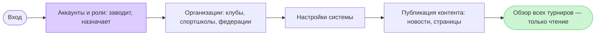

## 2. Председатель судейской коллегии

**Десктоп.** Заводит турнир в календаре и решает, кто его судит: открывает приём
заявок судей, смотрит рейтинг, категорию и историю судейства заявившихся и
выбирает одного. Дальше
**два шлагбаума**: утверждает систему проведения до публикации и итоговый
протокол после игры. Сам турнир не ведёт.

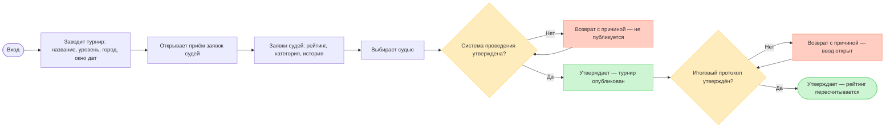

## 3. Главный судья турнира

**Десктоп.** Турнир не заводит: получает его по заявке от судейской коллегии.
Дальше ведёт от системы проведения до сдачи протокола — собирает сетку (из библиотеки
или конструктором), задаёт расписание и отправляет систему проведения на утверждение;
после публикации одобряет заявки, делает посев, назначает судей столов, вызывает
пары и переопределяет спорный счёт, каждая правка идёт в аудит. Формирует итоговый протокол
и сдаёт его коллегии, но рейтинг запускает **не он**: пересчёт идёт после
приёмки. Запуск блокируется, пока не на всех столах есть судьи.

```mermaid
flowchart LR
    login(["Вход"])
    apply["Подаёт заявку на судейство"]
    got["Назначен на турнир"]
    organize["Выбирает систему проведения: формат, дисциплина, число партий"]
    bracket["Собирает сетку: библиотека или конструктор"]
    schedule["Расписание по дням и столам"]
    submitOrg["Отправляет систему проведения на утверждение"]
    inbox["Заявки: от тренеров и от игроков"]
    decide{"Заявка одобрена?"}
    reject["Отклоняет с причиной"]
    accept["Принимает — игроки в составе"]
    seed["Делает посев"]
    tables["Назначает судей столов"]
    refGate{"Все столы с судьями?"}
    blocked["Турнир не запустится"]
    startT["Запускает турнир"]
    engineGen[["Движок генерирует сетку и столы"]]
    watch["Ведёт турнир: вызывает пары, следит"]
    dispute{"Спор по счёту?"}
    override["Переопределяет счёт"]
    allDone{"Все матчи сыграны?"}
    closeT(["Формирует итоговый протокол — уходит в коллегию"])

    login --> apply
    apply --> got
    got --> organize
    organize --> bracket
    bracket --> schedule
    schedule --> submitOrg
    submitOrg --> inbox
    inbox --> decide
    decide -->|"Нет"| reject
    reject --> inbox
    decide -->|"Да"| accept
    accept --> seed
    seed --> tables
    tables --> refGate
    refGate -->|"Нет"| blocked
    blocked --> tables
    refGate -->|"Да"| startT
    startT --> engineGen
    engineGen --> watch
    watch --> dispute
    dispute -->|"Да"| override
    override -.->|"Пишется в аудит"| watch
    dispute -->|"Нет"| allDone
    allDone -->|"Нет"| watch
    allDone -->|"Да"| closeT

    style engineGen fill:#DCCCFF,stroke:#874FFF
    style decide fill:#FFECBD,stroke:#FFC943
    style dispute fill:#FFECBD,stroke:#FFC943
    style refGate fill:#FFECBD,stroke:#FFC943
    style allDone fill:#FFECBD,stroke:#FFC943
    style reject fill:#FFCDC2,stroke:#FF7556
    style blocked fill:#FFCDC2,stroke:#FF7556
    style override fill:#FFCDC2,stroke:#FF7556
    style closeT fill:#CDF4D3,stroke:#66D575
```

## 4. Тренер

**Десктоп.** Подаёт **одну заявку на список игроков** — решение принимается по
заявке целиком. Не единственный путь в турнир: на открытые турниры игрок может
заявиться и сам. После одобрения тренер становится обычным зрителем.

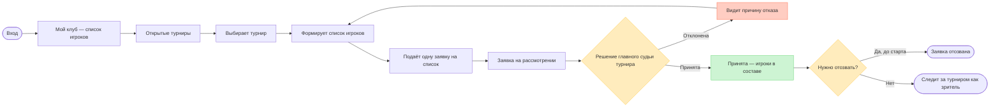

## 5. Бухгалтер

**Десктоп.** Ведёт реестр ежегодных регистрационных взносов: видит, у кого не
оплачено или просрочено, проверяет поступление и отмечает оплату. Состояние
взноса видно самому участнику и его тренеру.

Красный шаг — **наше допущение**, а не решение федерации: мы записали, что
заявка от участника с неоплаченным взносом не проходит. Там же открыт вопрос,
отмечает ли бухгалтер оплату руками или система принимает платежи сама
(см. [QUESTIONS.md](QUESTIONS.md) 6.1 и 6.5). Это разница между журналом учёта
и платёжным модулем.

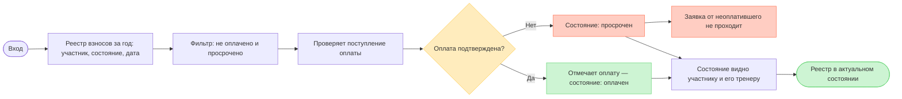

## 6. Судья стола

**Адаптивный сайт, обычно планшет.** Самая насыщенная роль: судья ведёт счёт
по розыгрышам и партиям, отслеживает подачу и смену сторон. Его счёт
**авторитетный**, подтверждение от игроков не требуется.

### Обрыв сети — отдельная ветка

Она вынесена, потому что идёт **параллельно** всему циклу выше: сеть может
пропасть в любой момент, и работа судьи от этого не останавливается.

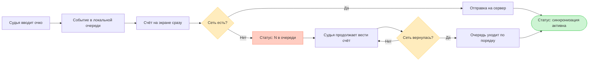

**Порядок событий восстанавливается по времени на устройстве, а не на сервере.**
После обрыва очередь уходит пачкой — серверные метки будут почти одинаковыми,
и последовательность розыгрышей развалится.

## 7. Игрок

**Сайт и приложение (iOS/Android).** Единственная роль с аналитикой; расширенная
аналитика платная (TZ §11). Счёт своих матчей не вводит — это делает судья стола.
На открытые турниры может заявиться **сам**.

## 8. Гость

Только чтение, без регистрации. Единственный выход из роли — регистрация.

---

# Ключевой сценарий: ввод счёта судьёй стола

Sequence-разрез того же процесса — видно, кто с кем разговаривает.

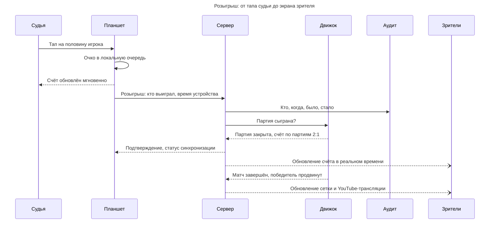
