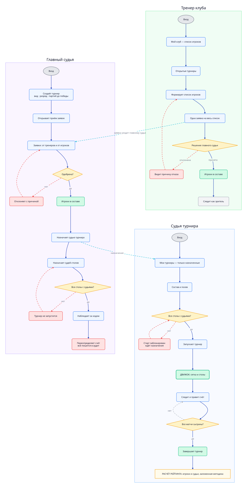
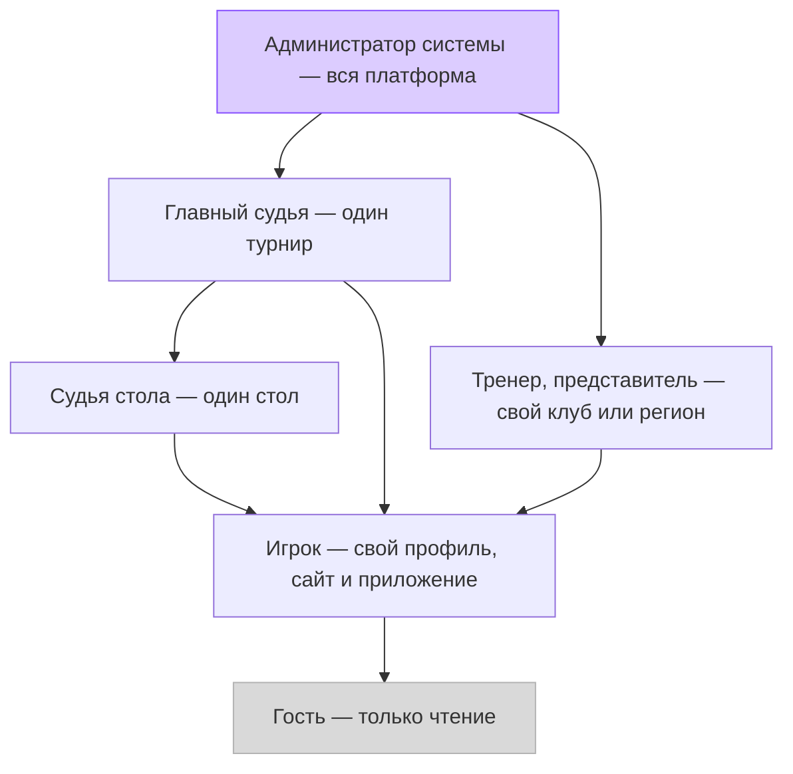
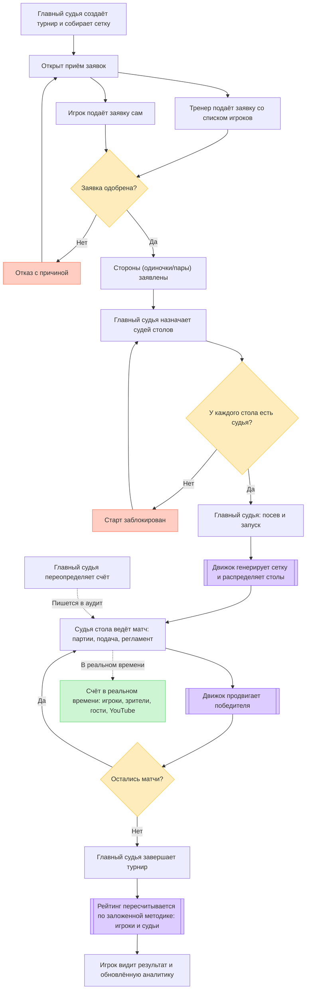
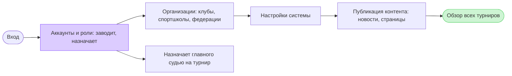
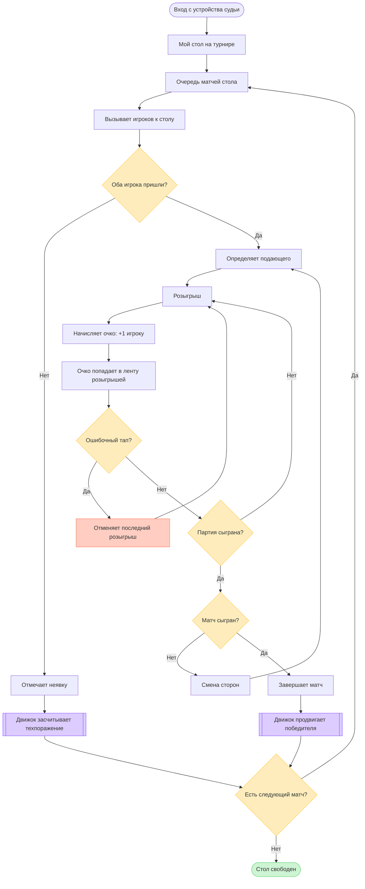
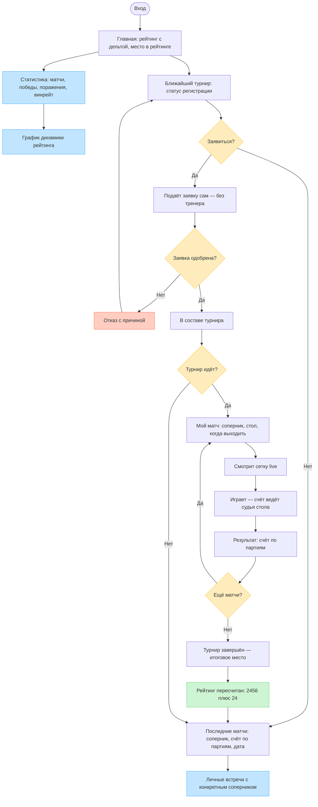
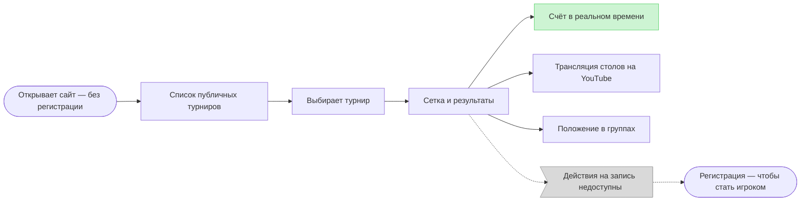
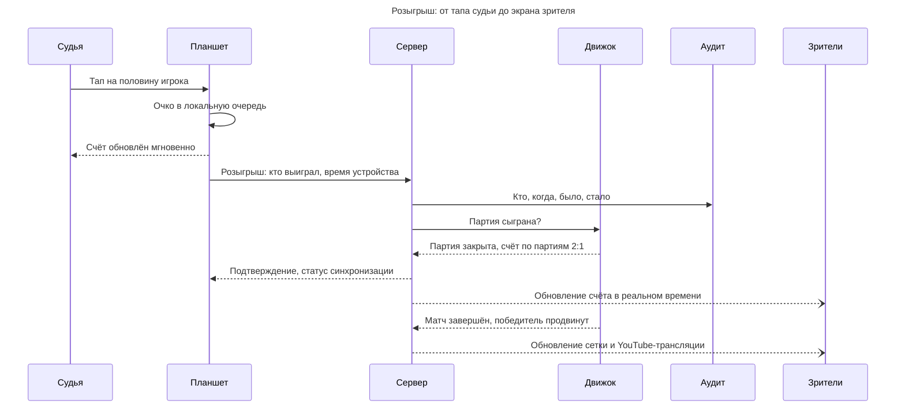

# User Flow

Кто что делает в системе.

- Системный дизайн — отдельно: [ARCHITECTURE.md](ARCHITECTURE.md)
- Требования: [TZ.md](TZ.md) · Дизайн: [DESIGN.md](DESIGN.md)
- Исходники диаграмм: [diagrams/](diagrams/) · сборка: `diagrams/build.ps1`

> Диаграммы на **[D2](https://d2lang.com)** — раскладку делает движок, а не я.
> Mermaid ниже оставлен как текстовая спецификация: правится в PR, рендерится
> без сборки.

## Как читать

Сначала иерархия (кто кого старше), потом жизненный цикл (что происходит
в целом), потом шесть ролевых флоу — что видит и делает **конкретный человек**.

Цвета: зелёный — шаги переиспользуемого движка и успешные исходы, жёлтый —
развилки, красный — блокировки и отказы.

## Иерархия ролей

## Жизненный цикл турнира

## Управляющие роли — десктоп

Показаны рядом, потому что их флоу сцеплены: администратор системы заводит
аккаунты и организации, тренер подаёт заявку, а главный судья одобряет,
собирает сетку и ведёт турнир.

## Судья стола — адаптивный сайт

Обрыв сети идёт **параллельно** всему циклу выше:

## Игрок — сайт и приложение

---

Ниже — то же самое в Mermaid, как текстовая спецификация.

## Три сквозных правила

Зафиксированы в [TZ.md](TZ.md) (§4.2, §8):

- **Заявка тренера** — одна заявка на **список игроков**, решение принимается по заявке целиком.
- **Самостоятельная заявка** — игрок может заявиться **сам**, без тренера, на открытые турниры.
- **Судья на столе** — **матч не стартует, пока на стол не назначен судья стола.** Блокирующее правило.

## Ограничения рендерера

- Никаких ` `, HTML-тегов и эмодзи в подписях.
- ID узлов — camelCase, без подчёркиваний.
- Зарезервированы: `end`, `subgraph`, `graph`, **`call`** (callback-директива).
- В sequence-диаграммах **не работают** `Note`, `alt`, `loop`, `opt` — молча выбрасываются.

---

# Обзор

## Иерархия ролей

Наследование прав: вышестоящая роль может всё, что может нижестоящая.

## Жизненный цикл турнира

Сквозной сценарий через все роли.

---

# Workflow по ролям

## 1. Администратор системы

**Десктоп.** Управляет всей платформой: заводит аккаунты и роли, ведёт
организации (клубы, спортшколы, федерации), настраивает систему и публикует
контент. Назначает главных судей на турниры и видит все турниры сверху. Сам
турниры не судит — это делает главный судья.

## 2. Главный судья

**Десктоп.** Создаёт турнир и ведёт его от начала до конца: собирает сетку
(из библиотеки или конструктором), открывает приём заявок и одобряет их, делает
посев, назначает судей столов, вызывает пары и переопределяет спорный счёт —
каждая правка идёт в аудит. Завершает турнир, что запускает пересчёт рейтинга.
Запуск блокируется, пока не на всех столах есть судьи.

```mermaid
flowchart LR
    login(["Вход"])
    create["Создаёт турнир: вид, разряд, формат сетки"]
    bracket["Собирает сетку: библиотека или конструктор"]
    openA["Открывает приём заявок"]
    inbox["Заявки: от тренеров и от игроков"]
    decide{"Заявка одобрена?"}
    reject["Отклоняет с причиной"]
    accept["Принимает — игроки в составе"]
    seed["Делает посев"]
    tables["Назначает судей столов"]
    refGate{"Все столы с судьями?"}
    blocked["Турнир не запустится"]
    startT["Запускает турнир"]
    engineGen[["Движок генерирует сетку и столы"]]
    watch["Ведёт турнир: вызывает пары, следит"]
    dispute{"Спор по счёту?"}
    override["Переопределяет счёт"]
    allDone{"Все матчи сыграны?"}
    finishT["Завершает турнир"]
    engineRating[["Рейтинг по заложенной методике: игроки и судьи"]]
    done(["Турнир завершён"])

    login --> create
    create --> bracket
    bracket --> openA
    openA --> inbox
    inbox --> decide
    decide -->|"Нет"| reject
    reject --> inbox
    decide -->|"Да"| accept
    accept --> seed
    seed --> tables
    tables --> refGate
    refGate -->|"Нет"| blocked
    blocked --> tables
    refGate -->|"Да"| startT
    startT --> engineGen
    engineGen --> watch
    watch --> dispute
    dispute -->|"Да"| override
    override -.->|"Пишется в аудит"| watch
    dispute -->|"Нет"| allDone
    allDone -->|"Нет"| watch
    allDone -->|"Да"| finishT
    finishT --> engineRating
    engineRating --> done

    style engineGen fill:#DCCCFF,stroke:#874FFF
    style engineRating fill:#DCCCFF,stroke:#874FFF
    style decide fill:#FFECBD,stroke:#FFC943
    style dispute fill:#FFECBD,stroke:#FFC943
    style refGate fill:#FFECBD,stroke:#FFC943
    style allDone fill:#FFECBD,stroke:#FFC943
    style reject fill:#FFCDC2,stroke:#FF7556
    style blocked fill:#FFCDC2,stroke:#FF7556
    style override fill:#FFCDC2,stroke:#FF7556
    style done fill:#CDF4D3,stroke:#66D575
```

## 3. Тренер, представитель

**Десктоп.** Подаёт **одну заявку на список игроков** — решение принимается по
заявке целиком. Не единственный путь в турнир: на открытые турниры игрок может
заявиться и сам. После одобрения тренер становится обычным зрителем.

```mermaid
flowchart LR
    login(["Вход"])
    club["Мой клуб — список игроков"]
    browse["Открытые турниры"]
    pick["Выбирает турнир"]
    roster["Формирует список игроков"]
    submit["Подаёт одну заявку на список"]
    pending["Заявка на рассмотрении"]
    verdict{"Решение главного судьи"}
    rejected["Видит причину отказа"]
    accepted["Принята — игроки в составе"]
    withdraw{"Нужно отозвать?"}
    cancelled(["Заявка отозвана"])
    watch(["Следит за турниром как зритель"])

    login --> club
    club --> browse
    browse --> pick
    pick --> roster
    roster --> submit
    submit --> pending
    pending --> verdict
    verdict -->|"Отклонена"| rejected
    rejected --> roster
    verdict -->|"Принята"| accepted
    accepted --> withdraw
    withdraw -->|"Да, до старта"| cancelled
    withdraw -->|"Нет"| watch

    style verdict fill:#FFECBD,stroke:#FFC943
    style withdraw fill:#FFECBD,stroke:#FFC943
    style rejected fill:#FFCDC2,stroke:#FF7556
    style accepted fill:#CDF4D3,stroke:#66D575
```

## 4. Судья стола

**Адаптивный сайт, обычно планшет.** Самая насыщенная роль: судья ведёт счёт
по розыгрышам и партиям, отслеживает подачу и смену сторон. Его счёт
**авторитетный**, подтверждение от игроков не требуется.

### Обрыв сети — отдельная ветка

Она вынесена, потому что идёт **параллельно** всему циклу выше: сеть может
пропасть в любой момент, и работа судьи от этого не останавливается.

**Порядок событий восстанавливается по времени на устройстве, а не на сервере.**
После обрыва очередь уходит пачкой — серверные метки будут почти одинаковыми,
и последовательность розыгрышей развалится.

## 5. Игрок

**Сайт и приложение (iOS/Android).** Единственная роль с аналитикой; расширенная
аналитика платная (TZ §11). Счёт своих матчей не вводит — это делает судья стола.
На открытые турниры может заявиться **сам**.

## 6. Гость

Только чтение, без регистрации. Единственный выход из роли — регистрация.

---

# Ключевой сценарий: ввод счёта судьёй стола

Sequence-разрез того же процесса — видно, кто с кем разговаривает.

